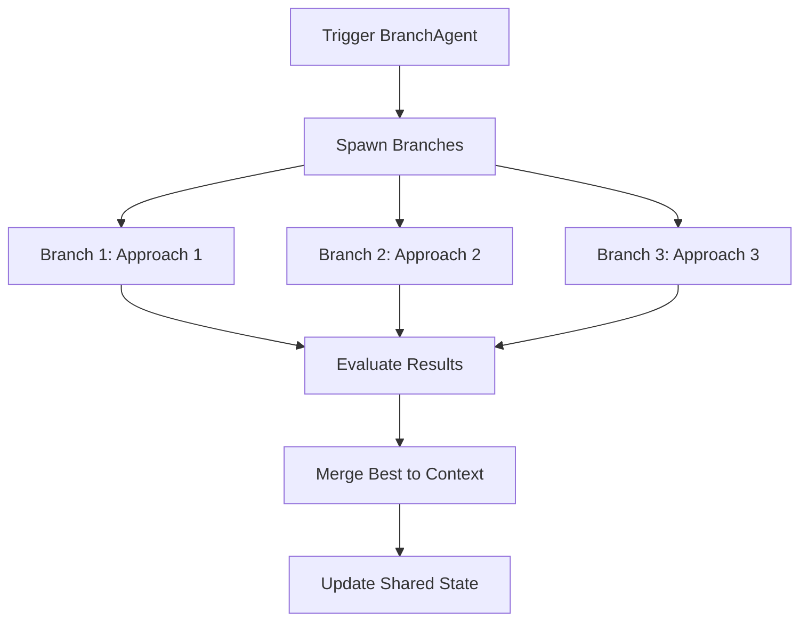

# Agent Layer Product Requirements Document: Multiagent Orchestration for Arxiv Research Agent

## Overview
This PRD details the agent layer of the Arxiv Research Agent, focusing on multiagent orchestration via LangGraph. It includes the supervisor for routing, subgraphs for CLI and automator tasks, and specialized agents like BranchAgent for dynamic context branching. The layer emphasizes stateful, adaptive reasoning while separating concerns (e.g., no direct LLM calls in non-agent components).

The agent layer enables intelligent task delegation, with BranchAgent as the primary specialized type for exploring multiple approaches and consolidating results.

## Supervisor Agent
- **Role**: Top-level router that evaluates user input and delegates to appropriate subgraphs.
- **Functionality**: Parses input (e.g., "chat" triggers CLI, "automate" triggers automator); updates shared state.
- **Integration**: LangGraph node; uses Command for routing.

## Subgraph Agents
### CLI Subgraph
- **Nodes**: input_node (validate query), rag_node (retrieve via RAG), response_node (generate reply), like_node (update preferences).
- **Purpose**: Interactive chat for research and paper management.
- **State**: Extends SharedState with user_query, retrieved_papers.

### Automator Subgraph
- **Nodes**: pull_node (fetch Arxiv papers), embed_node (generate vectors), similarity_node (compare to liked), classify_node (importance score), store_node (save to DB), clean_node (prune).
- **Purpose**: Background ingestion and classification.
- **State**: Extends SharedState with recent_papers, classified_papers.

## BranchAgent (Specialized Agent Type)
BranchAgent is the primary specialized agent type, enabling dynamic context branching for complex tasks.

### Overview
BranchAgent is a LangGraph node/agent that dynamically explores multiple approaches to solve a task (e.g., different RAG strategies or prompt variants), evaluates results via LLM, and merges the best outcome into the main conversation context. It is the only specialized agent type currently; others may be added later.

### Mechanism
- **Trigger**: Activated by supervisor or subgraphs for ambiguous/complex queries (e.g., heuristic on query length or entropy).
- **Exploration**: Spawns 2-3 parallel branches, each testing a variant (e.g., Path 1: Standard RAG; Path 2: Graph-enhanced; Path 3: Speculative).
- **Evaluation**: LLM scores each result (e.g., combine faithfulness and relevance scores).
- **Merging**: Selects best result; calls Context Management endpoints to merge into the context chain.
- **Integration**: Uses shared state; interfaces with Context Management for compression/merging.

### Architecture

### Requirements
- **Functional**: Explore 2-3 approaches; evaluate/merge reliably.
- **Non-Functional**: Max 3 branches to limit latency; LLM calls for eval; use LangGraph checkpointer for persistence, interrupts for human-in-loop, streaming for real-time responses.
- **Dependencies**: LangGraph (with checkpointer, interrupts, streaming), LLM integration.

## State Sharing & Communication
- **Shared State**: TypedDict with liked_embeddings, logs.
- **Communication**: Command-based routing; state mutations.
- **Persistence**: LangGraph checkpointer (MemorySaver) for graph state; DBs for long-term.
- **Advanced LangGraph Features**: Interrupts for user interventions (e.g., confirm branches); streaming for real-time node outputs; tool integration for external APIs (e.g., SDKs as tools).

## Requirements & Roadmap
- **Functional**: Route accurately; BranchAgent explores effectively.
- **Non-Functional**: Low latency; testable.
- **Roadmap**: Implement supervisor/subgraphs; add BranchAgent; test branching.

This PRD focuses on BranchAgent as the key specialized type. Reference PRD.md for overall integration.