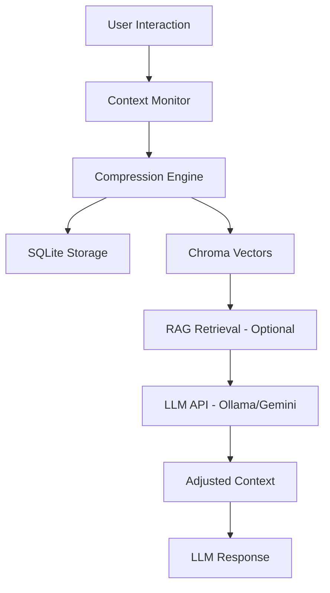
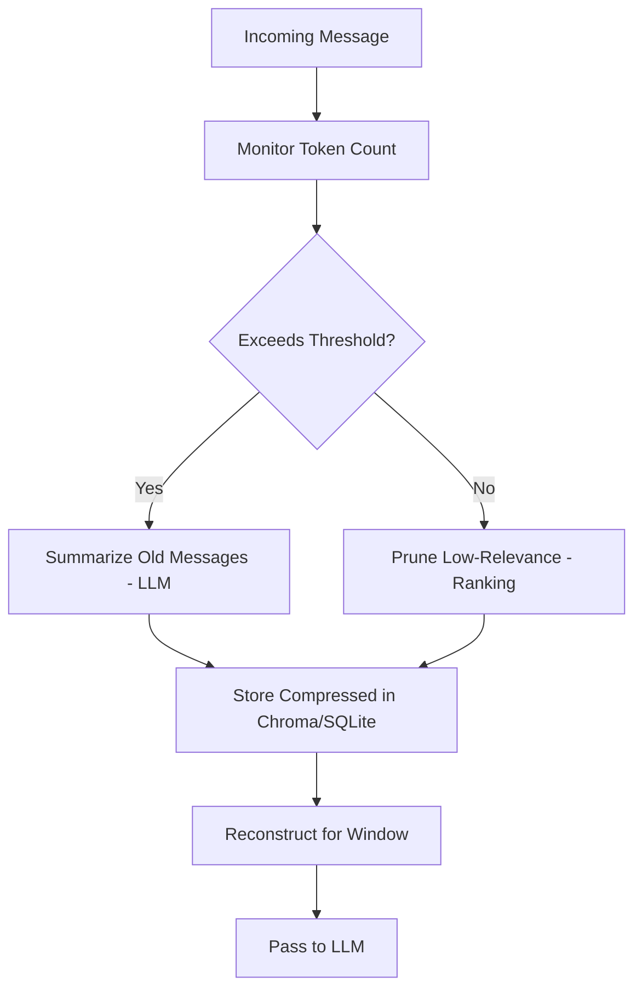
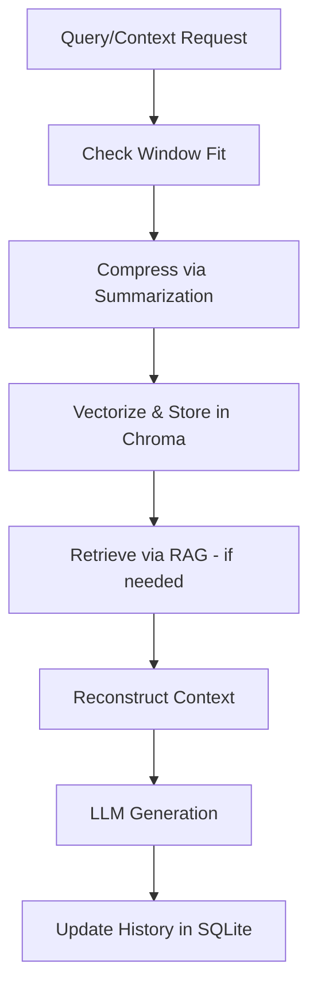

# Context Management Product Requirements Document: Adaptive Context Compression for Arxiv Research Agent

## Overview
This PRD details the Context Management system, a separate component for handling long conversation histories and fitting them within LLM context windows (e.g., Ollama's ~4k-8k tokens or Gemini's larger limits for consistency). It stores conversations in SQLite (structured logs) and Chroma (vectorized compressions), applying advanced compression techniques to preserve relevance while enabling efficient retrieval. The system interfaces with Ollama/Gemini APIs for summarization and can leverage RAG's Chroma for retrieving archived context, maintaining separation of concerns.

The Context Management ensures scalable, long-horizon interactions in the CLI chatbot and automator, preventing context overflow without losing critical history.

## Key Research Papers and Inspirations
This system draws from Arxiv papers (2024-2025) on context compression for LLMs with small windows, focusing on semantic and hierarchical techniques:

- **ACON: Optimizing Context Compression for Long-horizon LLM Agents** (Arxiv 2510.00615, 2025): Core inspiration for optimizing compression in agentic settings, using selective retention and summarization to fit long contexts.
  
- **MELODI: Exploring Memory Compression for Long Contexts** (Arxiv 2410.03156, 2024): Adopted for hierarchical memory architecture, compressing short-term and long-term contexts efficiently.

- **Compressing Lengthy Context With UltraGist** (Arxiv 2405.16635, 2024): Used for gist-based summarization to capture essential context in minimal tokens.

- **KVzip: Query-Agnostic KV Cache Compression with Context Reconstruction** (Arxiv 2025, OpenReview): Inspiration for KV cache compression and reconstruction, enabling reuse without full recomputation.

- **xRAG: Extreme Context Compression for Retrieval-augmented Generation with One Token** (Arxiv 2405.13792, 2024): For extreme compression techniques, reducing to minimal representations.

Additional context from **Extending Context Window via Semantic Compression** (ACL 2024): Emphasizes semantic methods for window extension, informing our hybrid approach.

These papers provide empirical backing for compression that maintains performance in long conversations.

## Core Architecture
The Context Management is a modular system with:
- **Storage Layer**: SQLite for relational conversation logs; Chroma for vectorized compressions.
- **Compression Layer**: LLM-driven summarization and pruning.
- **Retrieval Layer**: Query Chroma for archived context; interface with Ollama/Gemini.
- **Integration Layer**: LangGraph nodes for pre-LLM adjustments.

Components integrate via APIs, with fallbacks for robustness.

- **SQLite**: Stores full/raw conversation history.
- **Chroma**: Stores compressed vectors for quick retrieval.
- **Compression Engine**: Applies advanced features (e.g., summarization).
- **RAG Integration**: Separately queries Chroma for long-term context.

## Runtime Flow
The flow compresses and fits context dynamically, with hierarchical handling.

### Compression Flow

### Full Runtime (with Retrieval)

- **Key Flows**: Conditional compression (e.g., if >75% window, summarize); reconstruction pulls from vectors.
- **Error Handling**: Fallback to sliding window if compression fails.

## Components and Features
- **Storage**: SQLite for logs (sessions/messages tables); Chroma for embeddings of compressions.
- **Advanced Features**:
  - **Semantic Summarization**: LLM generates gists (UltraGist-style).
  - **Selective Pruning**: Rank by relevance, evict unimportant (ACON-style).
  - **KV Cache Compression**: Compress cached context (KVzip-style).
  - **Hierarchical Fitting**: Short-term in-window, long-term in DB.
  - **Reconstruction**: Rebuild from compressed data.
- **API Interfacing**: LangChain calls Ollama/Gemini for compression; Chroma for vector queries.
- **Integration**: Pre-LLM LangGraph node; uses RAG's Chroma separately.

## Requirements and Tradeoffs
- **Functional**: Compress/fit histories for Ollama (<4k) and Gemini (consistency).
- **Non-Functional**: Compression preserves 80% relevance; retrieval <1s.
- **Dependencies**: sqlite3, chromadb, langchain.
- **Tradeoffs**: Compression adds LLM calls (latency); separation avoids RAG coupling but requires duplicate Chroma usage.

## Integration with Arxiv Agent
- **BranchAgent Integration**: Provides endpoints (`compress_chain`, `merge_into_chain`) for BranchAgent to compress/merge context chains post-branching. Handles chain persistence and retrieval for dynamic merging.
- **CLI/Automator**: Pre-LLM nodes call compression for window fitting.
- **RAG**: Can query Chroma separately for archived history (separation of concerns). See AGENT_PRD.md for BranchAgent details.

## Implementation Roadmap
1. Setup: Init SQLite/Chroma.
2. Core: Build compression engine with endpoints.
3. Integration: Add to CLI/automator and BranchAgent.
4. Testing: Evaluate on long chats and branching.

This Context Management complements RAG for robust, long-context handling. Reference PRD.md for overall system integration.