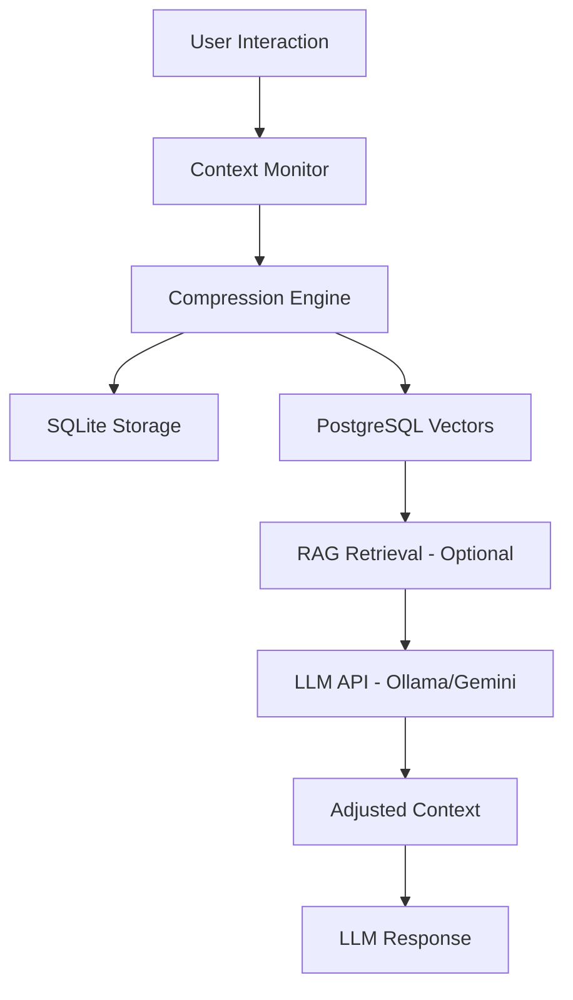
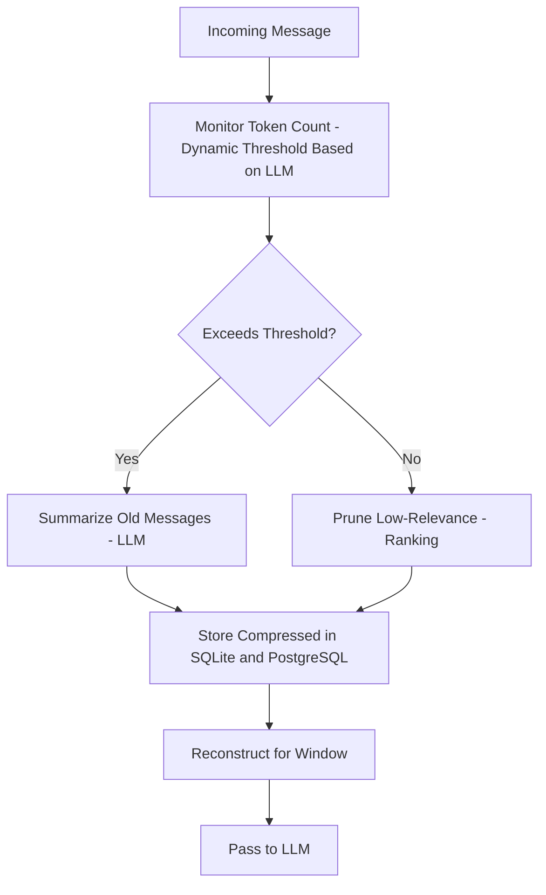
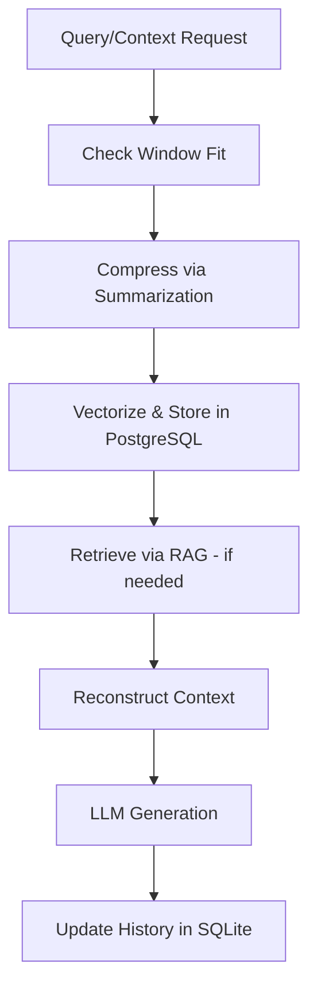

# Context Management Product Requirements Document: Adaptive Context Compression for Arxiv Research Agent

## Overview
This PRD details the Context Management system, a separate component for handling long conversation histories and fitting them within LLM context windows (e.g., Ollama's ~4k-8k tokens or Gemini's larger limits for consistency). It stores conversations in SQLite (structured logs) and PostgreSQL with pgvector (vectorized compressions), applying advanced compression techniques to preserve relevance while enabling efficient retrieval. The system interfaces with Ollama/Gemini APIs for summarization and can leverage PostgreSQL for retrieving archived context.

The Context Management ensures scalable, long-horizon interactions in the CLI chatbot and automator, preventing context overflow without losing critical history.

## Key Research Papers and Inspirations
This system draws from Arxiv papers (2024-2025) on context compression for LLMs with small windows, focusing on semantic and hierarchical techniques:

- **ACON: Optimizing Context Compression for Long-horizon LLM Agents** (Arxiv 2510.00615, 2025): Core inspiration for optimizing compression in agentic settings, using selective retention and summarization to fit long contexts.
  
- **MELODI: Exploring Memory Compression for Long Contexts** (Arxiv 2410.03156, 2024): Adopted for hierarchical memory architecture, compressing short-term and long-term contexts efficiently.

- **Compressing Lengthy Context With UltraGist** (Arxiv 2405.16635, 2024): Used for gist-based summarization to capture essential context in minimal tokens.

- **KVzip: Query-Agnostic KV Cache Compression with Context Reconstruction** (Arxiv 2025, OpenReview): Inspiration for KV cache compression and reconstruction, enabling reuse without full recomputation.

- **xRAG: Extreme Context Compression for Retrieval-augmented Generation with One Token** (Arxiv 2405.13792, 2024): For extreme compression techniques, reducing to minimal representations.

Additional context from **Extending Context Window via Semantic Compression** (ACL 2024): Emphasizes semantic methods for window extension, informing our hybrid approach.

These papers provide empirical backing for compression that maintains performance in long conversations.

## Core Architecture
The Context Management is a modular system with:
- **Storage Layer**: SQLite for relational conversation logs; PostgreSQL with pgvector for vectorized compressions.
- **Compression Layer**: LLM-driven summarization and pruning.
- **Retrieval Layer**: Query SQLite and PostgreSQL for archived context; interface with Ollama/Gemini.
- **Integration Layer**: Orchestral AI nodes for pre-LLM adjustments.

Components integrate via APIs, with fallbacks for robustness.


```mermaid
graph TD
    A[User Interaction] --> B[Context Monitor]
    B --> C[Compression Engine]
    C --> D[SQLite Storage]
    C --> E[PostgreSQL Vectors]
    E --> F[RAG Retrieval - Optional]
    F --> G[LLM API - Ollama/Gemini]
    G --> H[Adjusted Context]
    H --> I[LLM Response]
```

- **SQLite**: Stores full/raw conversation history.
- **PostgreSQL/pgvector**: Stores compressed vectors for quick retrieval.
- **Compression Engine**: Applies advanced features (e.g., summarization).

## Runtime Flow
The flow compresses and fits context dynamically, with hierarchical handling.

### Compression Flow

```mermaid
flowchart TD
    A[Incoming Message] --> B[Monitor Token Count - Dynamic Threshold Based on LLM]
    B --> C{Exceeds Threshold?}
    C -->|Yes| D[Summarize Old Messages - LLM]
    C -->|No| E[Prune Low-Relevance - Ranking]
    D --> F[Store Compressed in SQLite and PostgreSQL]
    E --> F
    F --> G[Reconstruct for Window]
    G --> H[Pass to LLM]
```

### Full Runtime (with Retrieval)

```mermaid
flowchart TD
    A[Query/Context Request] --> B[Check Window Fit]
    B --> C[Compress via Summarization]
    C --> D[Vectorize & Store in PostgreSQL]
    D --> E[Retrieve via RAG - if needed]
    E --> F[Reconstruct Context]
    F --> G[LLM Generation]
    G --> H[Update History in SQLite]
```

- **Key Flows**: Conditional compression (e.g., if >75% window, summarize); reconstruction pulls from vectors.
- **Error Handling**: Fallback to sliding window if compression fails.

## Components and Features
- **Storage**: SQLite for logs (sessions/messages tables); PostgreSQL for compressed contexts.
- **Advanced Features**:
  - **Semantic Summarization**: LLM generates gists (UltraGist-style).
  - **Selective Pruning**: Rank by relevance, evict unimportant (ACON-style).
  - **KV Cache Compression**: Compress cached context (KVzip-style).
  - **Hierarchical Fitting**: Short-term in-window, long-term in SQLite.
  - **Reconstruction**: Rebuild from compressed data.
- **API Interfacing**: Orchestral AI calls Ollama/Gemini for compression; PostgreSQL for vector queries.
- **Integration**: Pre-LLM Orchestral AI node; uses SQLite and PostgreSQL storage.

## Requirements and Tradeoffs
- **Functional**: Compress/fit histories with dynamic thresholds based on current LLM.
- **Non-Functional**: Compression preserves 80% relevance; retrieval <1s.
- **Dependencies**: sqlite3, psycopg2-binary, pgvector, orchestral-ai.
- **Tradeoffs**: Compression adds LLM calls (latency); SQLite + PostgreSQL storage is simpler but requires coordination.

## Integration with Arxiv Agent
- **BranchAgent Integration**: Provides endpoints (`compress_chain`, `merge_into_chain`) for BranchAgent to compress/merge context chains post-branching. Handles chain persistence and retrieval for dynamic merging.
- **CLI/Automator**: Pre-LLM nodes call compression for window fitting.
- **RAG**: Can query PostgreSQL separately for archived history.

## Implementation Roadmap
1. Setup: Init SQLite and PostgreSQL for storage.
2. Core: Build compression engine with SQLite/PostgreSQL storage.
3. Integration: Add to CLI/automator and BranchAgent.
4. Testing: Evaluate on long chats and branching.
5. Iteration: Optimize compression algorithms and performance.

## Cross-Context Storage Schema
```sql
-- SQLite schema for context management
CREATE TABLE IF NOT EXISTS conversations (
    id TEXT PRIMARY KEY,
    user_id TEXT NOT NULL,
    created_at TIMESTAMP DEFAULT CURRENT_TIMESTAMP,
    context_type TEXT DEFAULT 'chat',
    full_context TEXT,
    compressed_context TEXT,
    metadata TEXT
);

CREATE TABLE IF NOT EXISTS context_references (
    id INTEGER PRIMARY KEY AUTOINCREMENT,
    conversation_id TEXT REFERENCES conversations(id),
    reference_type TEXT,
    reference_id TEXT,
    relevance_score REAL,
    created_at TIMESTAMP DEFAULT CURRENT_TIMESTAMP
);
```

### Context Management Implementation
```python
import sqlite3
import psycopg2
from pgvector.psycopg2 import Vector
import json
from typing import List, Dict, Optional

class ContextManager:
    """Context manager using SQLite and PostgreSQL"""
    
    def __init__(self, db_path: str, postgres_url: str):
        self.conn = sqlite3.connect(db_path)
        self.pg_conn = psycopg2.connect(postgres_url)
        self.pg_cursor = self.pg_conn.cursor()
        self.pg_cursor.execute("CREATE TABLE IF NOT EXISTS context_compressions (id TEXT PRIMARY KEY, document TEXT, embedding vector(384))")
        self.pg_conn.commit()
        
    async def compress_and_store(self, conversation_id: str, context_data: Dict):
        """Compress and store context in SQLite and PostgreSQL"""
        compressed_summary = await self.llm_compress_context(context_data)
        context_vector = await self.embedding_model.embed(compressed_summary)
        
        cursor = self.conn.cursor()
        cursor.execute("""
            INSERT INTO conversations (id, user_id, context_type, full_context, compressed_context, metadata)
            VALUES (?, ?, ?, ?, ?, ?)
        """, (
            conversation_id,
            context_data.get('user_id'),
            'compression_summary',
            json.dumps(context_data.get('full_context', '')),
            compressed_summary,
            json.dumps(context_data.get('metadata', {}))
        ))
        
        self.pg_cursor.execute(
            "INSERT INTO context_compressions (id, document, embedding) VALUES (%s, %s, %s)",
            (conversation_id, compressed_summary, context_vector)
        )
        
        self.conn.commit()
        self.pg_conn.commit()
        
    async def retrieve_context(self, conversation_id: str, query_context: Optional[str] = None):
        """Retrieve context with optional semantic search"""
        cursor = self.conn.cursor()
        
        if query_context:
            query_vector = self.embedding_model.embed(query_context)
            self.pg_cursor.execute(
                "SELECT id, document, embedding <=> %s AS distance FROM context_compressions ORDER BY distance LIMIT 5",
                (query_vector,)
            )
            results = self.pg_cursor.fetchall()
            ids = [r[0] for r in results]
            
            if ids:
                placeholders = ','.join('?' * len(ids))
                cursor.execute(f"""
                    SELECT compressed_context FROM conversations WHERE id IN ({placeholders})
                    ORDER BY CASE id { ' '.join(f'WHEN ? THEN {i}' for i in range(len(ids))) } END
                """, ids + ids)
            else:
                cursor.execute("SELECT compressed_context FROM conversations WHERE id = ? ORDER BY created_at DESC LIMIT 1", (conversation_id,))
        else:
            cursor.execute("""
                SELECT compressed_context FROM conversations
                WHERE id = ?
                ORDER BY created_at DESC LIMIT 1
            """, (conversation_id,))
        
        return cursor.fetchall()
```

This Context Management complements hybrid RAG for robust, long-context handling. Reference PRD.md for overall system integration.