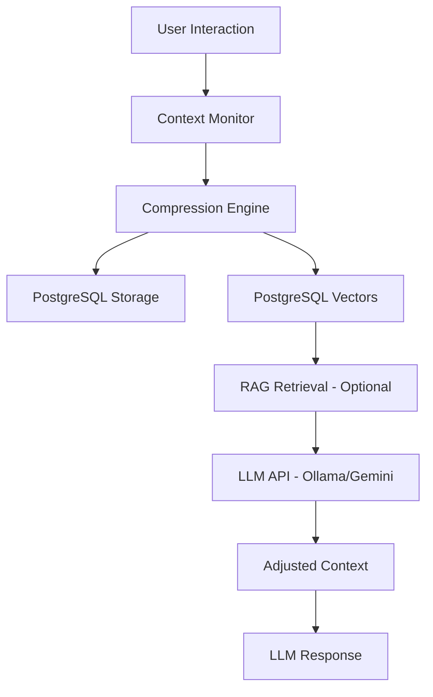
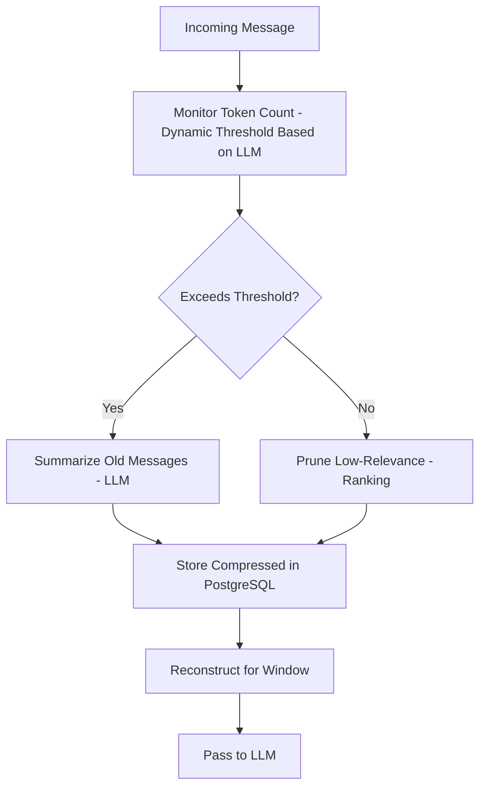
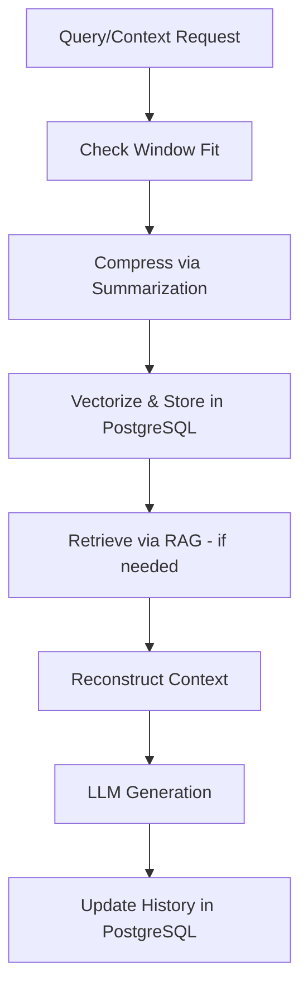

# Context Management Product Requirements Document: Adaptive Context Compression for Arxiv Research Agent

## Overview
This PRD details the Context Management system, a separate component for handling long conversation histories and fitting them within LLM context windows (e.g., Ollama's ~4k-8k tokens or Gemini's larger limits for consistency). It stores conversations in PostgreSQL (structured logs and vectorized compressions), applying advanced compression techniques to preserve relevance while enabling efficient retrieval. The system interfaces with Ollama/Gemini APIs for summarization and can leverage RAG's PostgreSQL for retrieving archived context, maintaining separation of concerns.

The Context Management ensures scalable, long-horizon interactions in the CLI chatbot and automator, preventing context overflow without losing critical history.

## Key Research Papers and Inspirations
This system draws from Arxiv papers (2024-2025) on context compression for LLMs with small windows, focusing on semantic and hierarchical techniques:

- **ACON: Optimizing Context Compression for Long-horizon LLM Agents** (Arxiv 2510.00615, 2025): Core inspiration for optimizing compression in agentic settings, using selective retention and summarization to fit long contexts.
  
- **MELODI: Exploring Memory Compression for Long Contexts** (Arxiv 2410.03156, 2024): Adopted for hierarchical memory architecture, compressing short-term and long-term contexts efficiently.

- **Compressing Lengthy Context With UltraGist** (Arxiv 2405.16635, 2024): Used for gist-based summarization to capture essential context in minimal tokens.

- **KVzip: Query-Agnostic KV Cache Compression with Context Reconstruction** (Arxiv 2025, OpenReview): Inspiration for KV cache compression and reconstruction, enabling reuse without full recomputation.

- **xRAG: Extreme Context Compression for Retrieval-augmented Generation with One Token** (Arxiv 2405.13792, 2024): For extreme compression techniques, reducing to minimal representations.

Additional context from **Extending Context Window via Semantic Compression** (ACL 2024): Emphasizes semantic methods for window extension, informing our hybrid approach.

These papers provide empirical backing for compression that maintains performance in long conversations.

## Core Architecture
The Context Management is a modular system with:
- **Storage Layer**: PostgreSQL for relational conversation logs and vectorized compressions.
- **Compression Layer**: LLM-driven summarization and pruning.
- **Retrieval Layer**: Query PostgreSQL for archived context; interface with Ollama/Gemini.
- **Integration Layer**: LangGraph nodes for pre-LLM adjustments.

Components integrate via APIs, with fallbacks for robustness.


```mermaid
graph TD
    A[User Interaction] --> B[Context Monitor]
    B --> C[Compression Engine]
    C --> D[PostgreSQL Storage]
    C --> E[PostgreSQL Vectors]
    E --> F[RAG Retrieval - Optional]
    F --> G[LLM API - Ollama/Gemini]
    G --> H[Adjusted Context]
    H --> I[LLM Response]
```

- **PostgreSQL**: Stores full/raw conversation history and compressed vectors for quick retrieval.
- **Compression Engine**: Applies advanced features (e.g., summarization).
- **RAG Integration**: Separately queries PostgreSQL for long-term context.

## Runtime Flow
The flow compresses and fits context dynamically, with hierarchical handling.

### Compression Flow

```mermaid
flowchart TD
    A[Incoming Message] --> B[Monitor Token Count - Dynamic Threshold Based on LLM]
    B --> C{Exceeds Threshold?}
    C -->|Yes| D[Summarize Old Messages - LLM]
    C -->|No| E[Prune Low-Relevance - Ranking]
    D --> F[Store Compressed in PostgreSQL]
    E --> F
    F --> G[Reconstruct for Window]
    G --> H[Pass to LLM]
```

### Full Runtime (with Retrieval)

```mermaid
flowchart TD
    A[Query/Context Request] --> B[Check Window Fit]
    B --> C[Compress via Summarization]
    C --> D[Vectorize & Store in PostgreSQL]
    D --> E[Retrieve via RAG - if needed]
    E --> F[Reconstruct Context]
    F --> G[LLM Generation]
    G --> H[Update History in PostgreSQL]
```

- **Key Flows**: Conditional compression (e.g., if >75% window, summarize); reconstruction pulls from vectors.
- **Error Handling**: Fallback to sliding window if compression fails.

## Components and Features
- **Storage**: PostgreSQL for logs (sessions/messages tables) and compressed contexts.
- **Advanced Features**:
  - **Semantic Summarization**: LLM generates gists (UltraGist-style).
  - **Selective Pruning**: Rank by relevance, evict unimportant (ACON-style).
  - **KV Cache Compression**: Compress cached context (KVzip-style).
  - **Hierarchical Fitting**: Short-term in-window, long-term in DB.
  - **Reconstruction**: Rebuild from compressed data.
- **API Interfacing**: LangChain calls Ollama/Gemini for compression; PostgreSQL for vector queries.
- **Integration**: Pre-LLM LangGraph node; uses PostgreSQL storage.

## Requirements and Tradeoffs
- **Functional**: Compress/fit histories with dynamic thresholds based on current LLM.
- **Non-Functional**: Compression preserves 80% relevance; retrieval <1s.
- **Dependencies**: psycopg2, langchain, langchain-postgres, langchain_ollama.
- **Tradeoffs**: Compression adds LLM calls (latency); unified PostgreSQL storage eliminates synchronization complexity.

## Integration with Arxiv Agent
- **BranchAgent Integration**: Provides endpoints (`compress_chain`, `merge_into_chain`) for BranchAgent to compress/merge context chains post-branching. Handles chain persistence and retrieval for dynamic merging.
- **CLI/Automator**: Pre-LLM nodes call compression for window fitting.
- **RAG**: Can query PostgreSQL separately for archived history (unified storage).

## Implementation Roadmap
1. Setup: Init PostgreSQL with pgvector extension for unified storage.
2. Core: Build compression engine with unified PostgreSQL storage; eliminate cross-system complexity.
3. Integration: Add to CLI/automator and BranchAgent with PostgreSQL-only context management.
4. Testing: Evaluate on long chats and branching with unified data access.
5. Iteration: Optimize compression algorithms and performance monitoring for PostgreSQL storage.

## Cross-Database Context Integration
### Unified Context Storage Schema
```sql
-- Enhanced PostgreSQL schema for context management
CREATE TABLE conversations (
    id UUID PRIMARY KEY DEFAULT gen_random_uuid(),
    user_id VARCHAR(100) NOT NULL,
    created_at TIMESTAMP DEFAULT NOW(),
    context_type VARCHAR(20) DEFAULT 'chat',  -- chat, compression_summary, archived
    full_context TEXT,                    -- Full conversation context
    compressed_context TEXT,                  -- Compressed summary
    context_vector VECTOR(1536),               -- Vector for similarity search
    metadata JSONB,                          -- Additional context metadata
    last_accessed TIMESTAMP DEFAULT NOW()
);

-- Cross-reference tracking
CREATE TABLE context_cross_references (
    id UUID PRIMARY KEY DEFAULT gen_random_uuid(),
    conversation_id UUID REFERENCES conversations(id),
    reference_type VARCHAR(20),              -- paper, author, topic
    reference_id VARCHAR(100),              -- arxiv_id, author name, etc.
    relevance_score DECIMAL(3,2),
    created_at TIMESTAMP DEFAULT NOW()
);
```

### Performance Optimization for Context Compression
```python
class PostgreSQLContextManager:
    """Context manager optimized for unified PostgreSQL storage"""
    
    def __init__(self, pg_pool):
        self.pg_pool = pg_pool
        self.compression_cache = {}
        
    async def compress_and_store(self, conversation_id, context_data):
        """Compress and store context in PostgreSQL"""
        # Generate compression summary
        compressed_summary = await self.llm_compress_context(context_data)
        
        # Generate context vector for retrieval
        context_vector = await self.embedding_model.embed(context_data)
        
        # Store in PostgreSQL with cross-references
        await self.pg_pool.execute("""
            INSERT INTO conversations (id, user_id, context_type, full_context, 
                                     compressed_context, context_vector, metadata)
            VALUES ($1, $2, $3, $4, $5, $6, $7, 
                    json.dumps(context_data.get('metadata', {})))
            
            INSERT INTO context_cross_references (conversation_id, reference_type, 
                                           reference_id, relevance_score)
            SELECT $1, ref.type, ref.id, ref.score
            FROM UNNEST($8::jsonb) as ref(type, id, score)
        """, conversation_id, context_data.get('user_id'), 'compression_summary',
            compressed_summary, context_vector, 
            json.dumps(context_data.get('metadata', {})))
        
    async def retrieve_context(self, conversation_id, query_context=None):
        """Retrieve context with optional semantic search"""
        if query_context:
            # Use vector similarity search
            results = await self.pg_pool.fetch("""
                SELECT compressed_context, context_vector, relevance_score
                FROM conversations c
                LEFT JOIN context_cross_references cr ON c.id = cr.conversation_id
                WHERE c.id = $1
                ORDER BY c.context_vector <=> $2::vector
                LIMIT 5
            """, conversation_id, self.embed_query(query_context))
        else:
            # Retrieve recent context directly
            results = await self.pg_pool.fetch("""
                SELECT compressed_context, context_vector
                FROM conversations c
                WHERE c.id = $1
                ORDER BY c.last_accessed DESC
                LIMIT 1
            """, conversation_id)
        
        return results
```


This Context Management complements hybrid RAG for robust, long-context handling. Reference PRD.md for overall system integration.