# Arxiv Research Agent Architecture Analysis

## Pain Points and Difficult Code Areas

### 1. Multi-Database Coordination Complexity

**Pain Point:** Coordinating between PostgreSQL, Neo4j, and SQLite creates significant complexity:
- **Schema Synchronization**: Ensuring consistent data models across three different database systems
- **Transaction Management**: No native distributed transactions across heterogeneous databases
- **Performance Bottlenecks**: Each database has different query patterns and optimization strategies
- **Data Consistency**: Maintaining ACID properties across multiple systems

**Difficult Code Areas:**
- `database/coordination.py`: Managing cross-database transactions
- `embeddings/embedding_manager.py`: Coordinating embedding storage across PostgreSQL and Neo4j
- `live_data_integration/data_fusion.py`: Merging data from multiple sources

### 2. Hybrid RAG Implementation Challenges

**Pain Point:** Implementing effective hybrid retrieval combining vector search and graph-based search:
- **Query Routing**: Determining when to use PostgreSQL vs Neo4j vs both
- **Result Fusion**: Combining heterogeneous result sets with different relevance scores
- **Performance Optimization**: Balancing speed vs accuracy across different retrieval methods
- **Caching Strategy**: Managing cache coherence across multiple retrieval systems

**Difficult Code Areas:**
- `rag/rag_manager.py`: Core hybrid retrieval logic
- `rag/query_router.py`: Intelligent query routing decisions
- `rag/result_fuser.py`: Complex result combination algorithms

### 3. LangGraph State Management Complexity

**Pain Point:** Managing complex state across multiple agents and workflows:
- **State Schema Evolution**: Handling changes to TypedDict schemas across versions
- **Checkpointing Overhead**: Performance impact of frequent state persistence
- **State Compression**: Managing large state objects in memory
- **Error Recovery**: Complex state restoration after failures

**Difficult Code Areas:**
- `agents/shared_state.py`: Complex state schema definitions
- `agents/research_graph.py`: State management in main research workflow
- `agents/automator_graph.py`: State persistence in background processing

### 4. Multi-Agent Coordination Challenges

**Pain Point:** Coordinating multiple LangGraph agents with different responsibilities:
- **Message Passing**: Ensuring reliable communication between agents
- **State Isolation**: Preventing state contamination between agents
- **Error Propagation**: Handling failures across agent boundaries
- **Resource Management**: Coordinating database connections and LLM API usage

**Difficult Code Areas:**
- `agents/agent_coordinator.py`: Multi-agent orchestration logic
- `agents/message_router.py`: Inter-agent communication system
- `agents/resource_manager.py`: Shared resource coordination

### 5. Embedding Strategy Complexity

**Pain Point:** Managing multiple embedding strategies and models:
- **Model Selection**: Choosing appropriate models for different content types
- **Embedding Storage**: Efficiently storing multiple embedding types
- **Similarity Calculation**: Handling different embedding dimensions and similarity metrics
- **Model Updates**: Managing model versioning and embedding migration

**Difficult Code Areas:**
- `embeddings/strategy_manager.py`: Multi-model coordination
- `embeddings/embedding_storage.py`: Complex embedding storage logic
- `embeddings/similarity_calculator.py`: Dimension-agnostic similarity calculations

## System Architecture - Mermaid Diagrams

### 1. Overall System Architecture

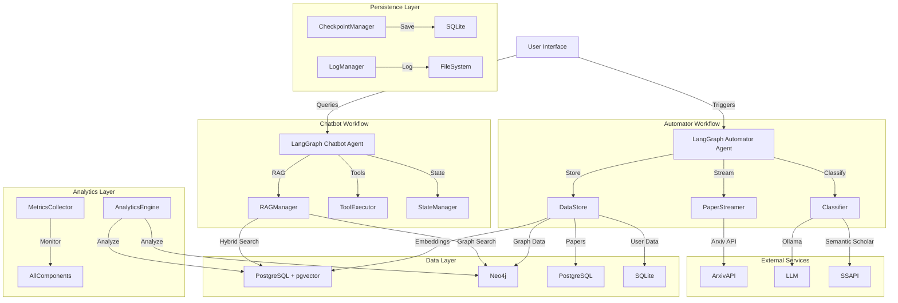

### 2. Hybrid RAG Retrieval Flow

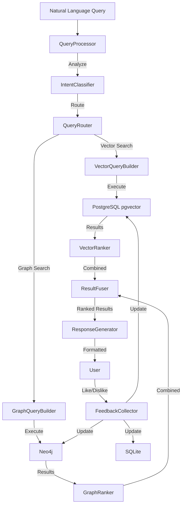

### 3. Multi-Agent Coordination Flow

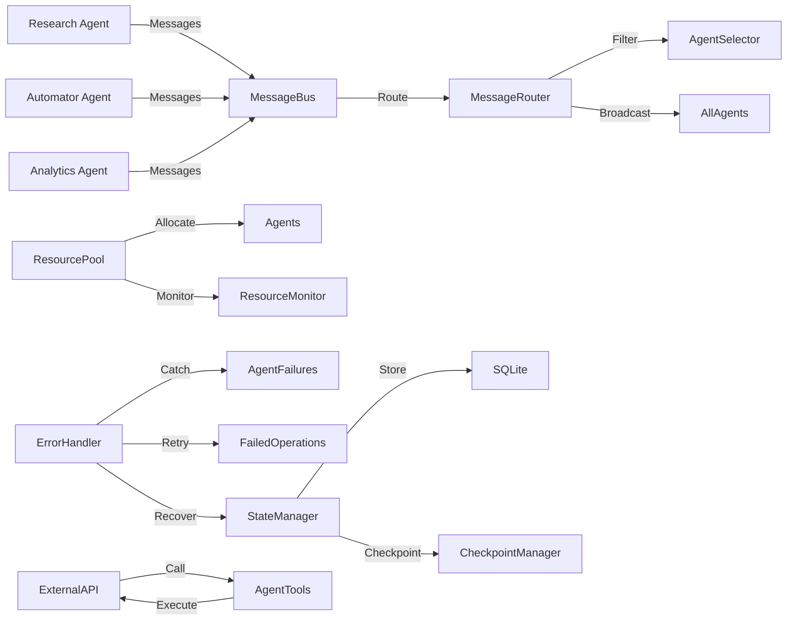

### 4. Data Flow and Storage Architecture

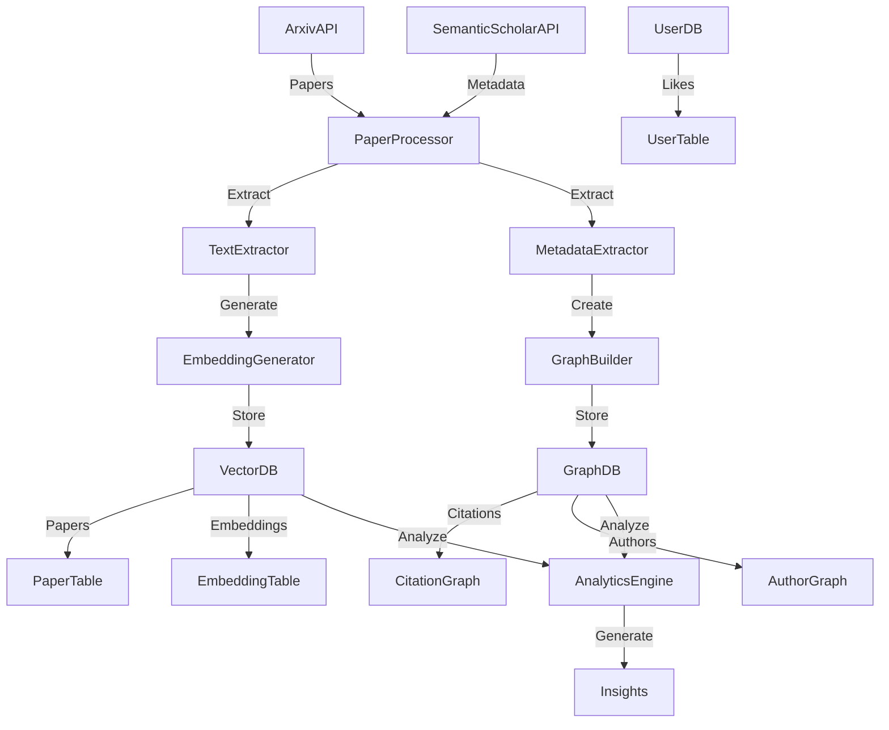

### 5. State Management and Checkpointing

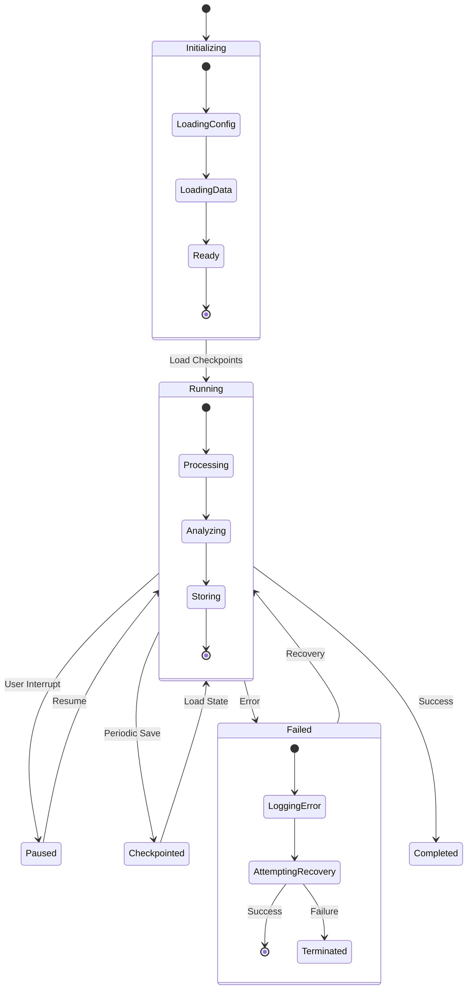

### 6. Progressive Analytics Dashboard

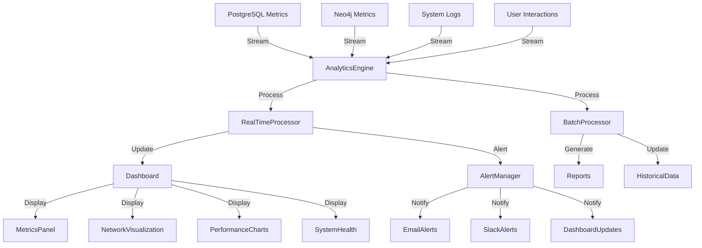

## Detailed Architecture Components

### 1. LangGraph Agent Design Patterns

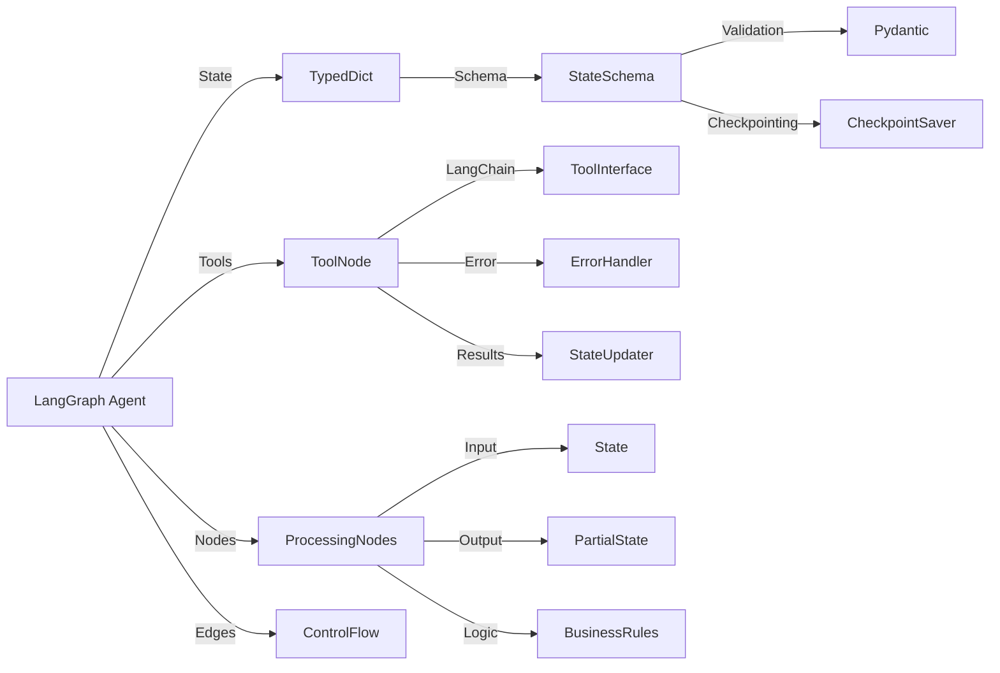

### 2. Database Integration Patterns

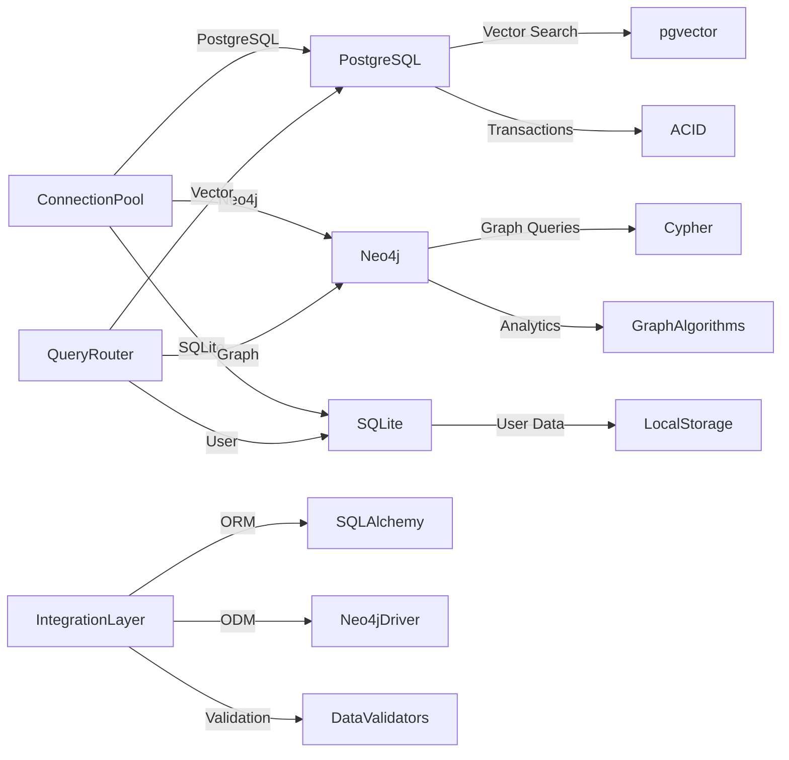

### 3. Error Handling and Recovery

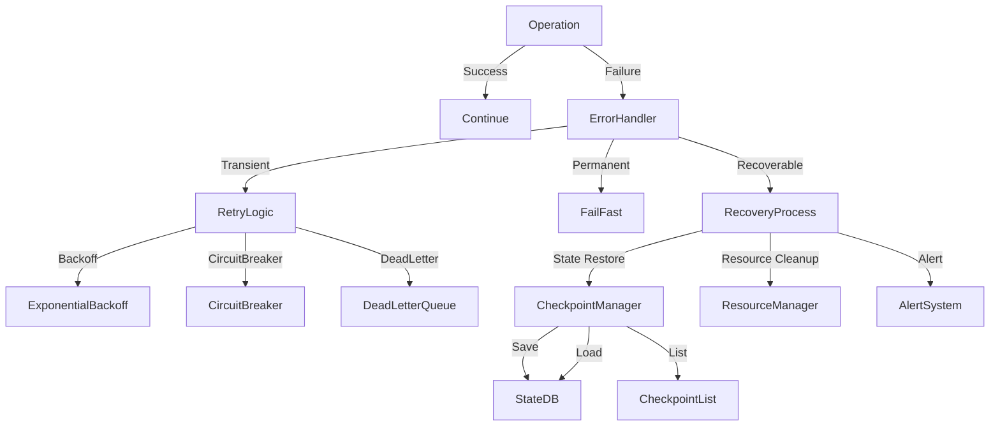

## Performance and Scalability Considerations

### 1. Query Performance Optimization

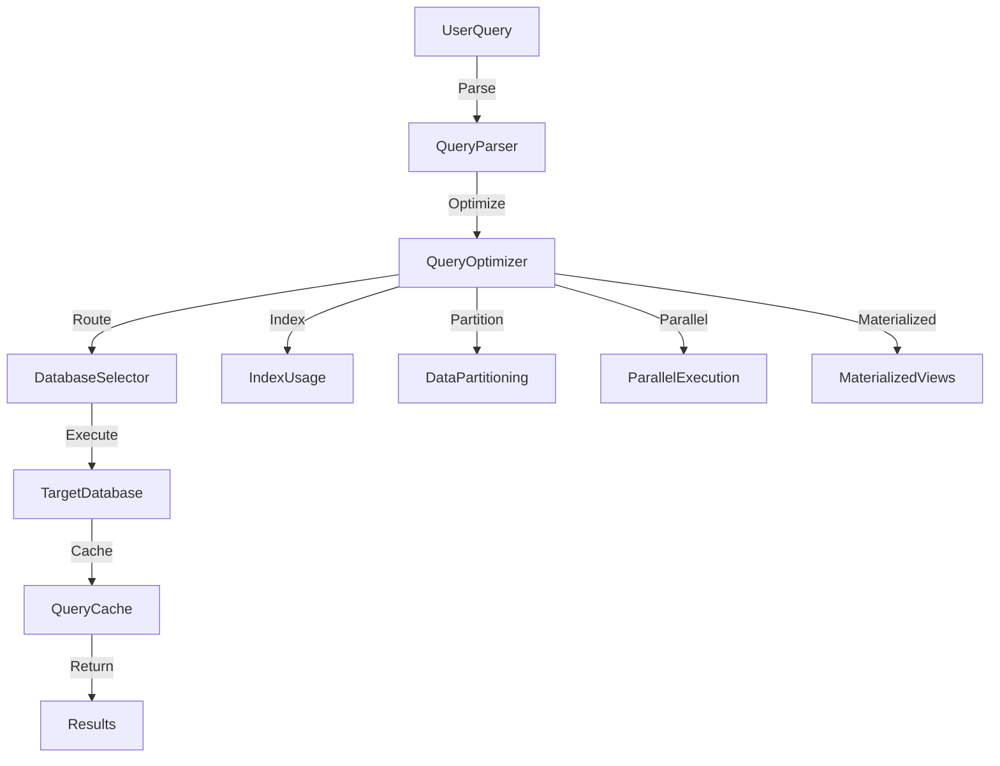

### 2. Memory Management

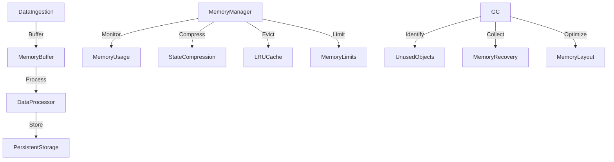

## Security and Compliance

### 1. Data Protection

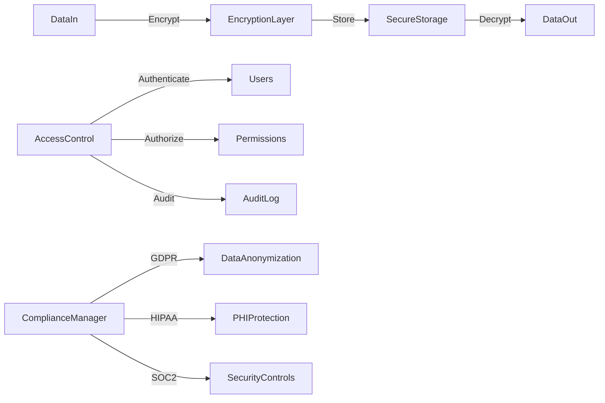

This comprehensive analysis covers the pain points, difficult code areas, and provides detailed architectural diagrams for the Arxiv Research Agent system. The diagrams illustrate the complex interactions between components, data flows, and system architecture patterns.