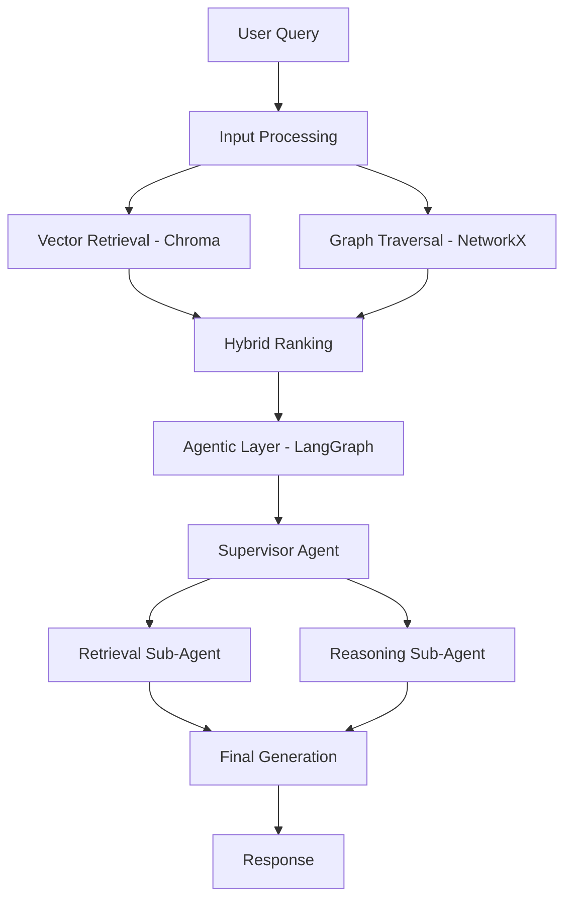
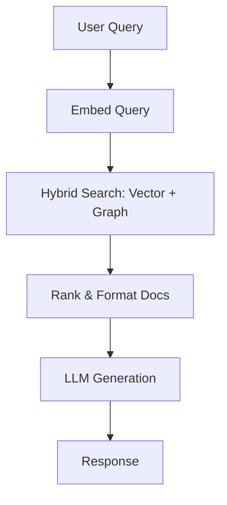
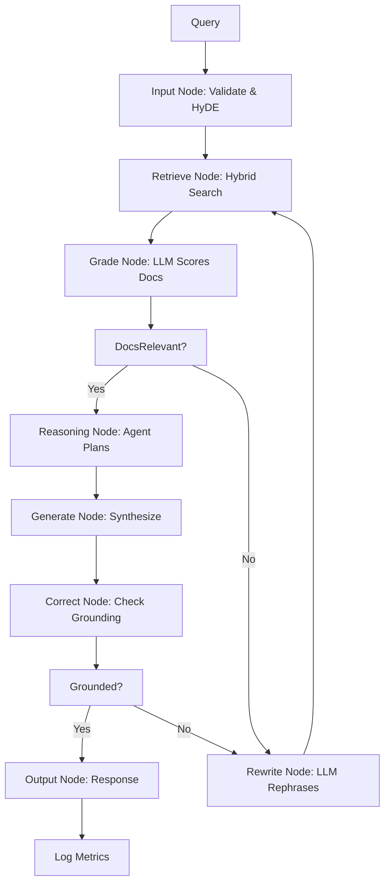

# RAG Product Requirements Document: Graph-Enhanced Agentic RAG for Arxiv Research Agent

## Overview
This PRD details the "Graph-Enhanced Agentic RAG" system, a sophisticated hybrid retrieval-augmented generation framework inspired by modern Arxiv papers. It combines vector-based retrieval (via Chroma), knowledge graph reasoning (for structured relations like citations), and hierarchical multi-agent orchestration (via LangGraph) to enable deep, faithful reasoning for Arxiv paper queries. The system addresses limitations of vanilla RAG (e.g., surface-level similarity) by modeling domain-specific relations and enabling agentic adaptation.

The RAG works in two modes:
- **Pre-Agent**: A standalone chain for quick, direct retrieval and generation.
- **Agent Tool**: Integrated into LangGraph graphs for iterative, multi-step reasoning in the CLI chatbot and user-triggered automator.

This design ensures robustness, scalability, and alignment with Arxiv's citation-heavy ecosystem, enhancing the overall research agent.

## Key Research Papers and Inspirations
This system draws from cutting-edge Arxiv papers (2024-2025) on advanced RAG, focusing on graph-based and agentic enhancements for improved reasoning and faithfulness:

- **Think-on-Graph 2.0: Deep and Faithful Large Language Model Reasoning with Knowledge-guided Retrieval Augmented Generation** (Arxiv 2407.10805, 2024-2025): Core inspiration for knowledge-guided graph reasoning. It uses graphs to model entity relations (e.g., paper citations, co-authorship) during retrieval, enabling "deep and faithful" generation by conditioning on structured knowledge. Applied here to Arxiv's relational data for better similarity and reasoning.
  
- **HM-RAG: Hierarchical Multi-Agent Multimodal Retrieval Augmented Generation** (Arxiv 2504.12330, 2025): Inspiration for hierarchical multi-agent architecture. It coordinates sub-agents across heterogeneous data for complex queries. Used to structure the agentic layer, allowing supervisor routing and collaborative reasoning in the RAG graph.

Additional context from surveys:
- **Retrieval-Augmented Generation: A Comprehensive Survey of Architectures, Enhancements, and Robustness Frontiers** (Arxiv 2506.00054, 2025): Highlights gaps in multimodal and robustness; this system addresses text-domain robustness via graphs and agents.
- **A Systematic Review of Key Retrieval-Augmented Generation (RAG) Systems** (Arxiv 2507.18910, 2025): Emphasizes agentic and hybrid approaches for industry; informs the dual-mode design.

These papers provide empirical backing for graph-agent hybrids, outperforming vector-only RAG in depth and fidelity.

## Core Architecture
The RAG is a hybrid system with three pillars:
- **Vector Retrieval**: Chroma DB for embedding-based similarity (using Ollama/Gemini).
- **Knowledge Graph**: Lightweight graph (NetworkX) for entity-relation modeling (papers, authors, citations).
- **Agentic Orchestration**: LangGraph for hierarchical agents (supervisor + sub-agents) handling reasoning and routing.

Components integrate via APIs, with fallbacks for robustness.

- **Vector Retrieval (Chroma)**: Embeds and stores paper abstracts; performs semantic search.
- **Knowledge Graph (NetworkX)**: Models relations; queries for connected entities.
- **Agentic Layer (LangGraph)**: Nodes for grading, rewriting; edges for conditional flow.
- **Integration**: Shared state across components; LLMs (Ollama primary) for generation/grading.

## Runtime Flow
The flow adapts based on mode and query complexity, with conditional routing for efficiency.

### Pre-Agent Mode (Standalone Chain)
For simple queries: Retrieve → Generate.

### Agent Tool Mode (LangGraph Graph)
For complex queries: Full reasoning with agents.

- **Key Flows**: Conditional edges (e.g., retry on low relevance); agents handle multi-step (e.g., reasoning sub-agent for citations).
- **Error Handling**: Retries for API failures; interrupts for graph issues.
- **Performance**: Async for retrieval; max 3 rewrites to avoid loops.

## Components and Features
- **Vector Retrieval**: Chroma with Ollama embeddings; hybrid (semantic + keyword).
- **Knowledge Graph**: NetworkX for graphs; key algorithms:
  - **PageRank**: Ranks nodes by importance based on incoming links (citations). Iteratively calculates scores—higher for nodes linked by influential others. Used to rank retrieved papers by citation influence.
  - **Centrality**: Measures node influence (e.g., degree for connections, betweenness for bridges in citation networks).
  - **Shortest Path**: Finds related papers via minimal citation hops. Nodes (papers/authors), edges (citations).
- **Agentic Layer**: Supervisor routes to sub-agents (retrieval, reasoning); Command-based routing in LangGraph.
- **LLM Integration**: Ollama for local; Gemini fallback. Structured prompts for grading/rewriting.
- **Modes**:
  - Pre-Agent: LCEL chain for fast responses.
  - Agent Tool: Full graph for adaptive reasoning.
- **Features**: 
  - Speculative drafting (LLM drafts response to guide retrieval).
  - HyDE (Hypothetical Document Embeddings—generate hypothetical answer via LLM, embed for better document matching).
  - Cascading grading (multi-stage relevance checks).
  - Multimodal-ready (extend for figures).

## Requirements and Tradeoffs
- **Functional**: Retrieve Arxiv papers via vectors/graphs; generate faithful answers; classify/ingest via agents.
- **Non-Functional**: Scalability (1000+ papers); latency (<5s for retrieval); robustness (handle noisy metadata).
- **Dependencies**: langchain_chroma, networkx, langgraph, langchain_ollama.
- **Tradeoffs**:
  - Graph adds depth but complexity/setup time; use NetworkX for simplicity.
  - Agents improve reasoning but increase latency; limit to complex queries.
  - Vector-only fallback if graph sparse.

## Integration with Arxiv Agent
- **CLI**: Pre-agent for "research X" (direct answer). Agent tool: In rag_node, call RAG graph if query needs retrieval.
- **Automator**: Agent tool in similarity_node (retrieve similar to liked embeddings for ingestion).
- **Ingestion**: On new papers, embed abstracts; add to Chroma with metadata.
- **Context Management**: RAG's Chroma can be queried separately for retrieving compressed conversation history (separation of concerns). See CONTEXT_PRD.md for details.

## Implementation Roadmap
1. Setup: Init Chroma, NetworkX, Ollama.
2. Core: Build graph and agents.
3. Integration: Plug into CLI/automator.
4. Testing: Evaluate on Arxiv queries.
5. Iteration: Add multimodal if needed.

This RAG elevates the agent with paper-inspired sophistication. Reference PRD.md for overall system integration.