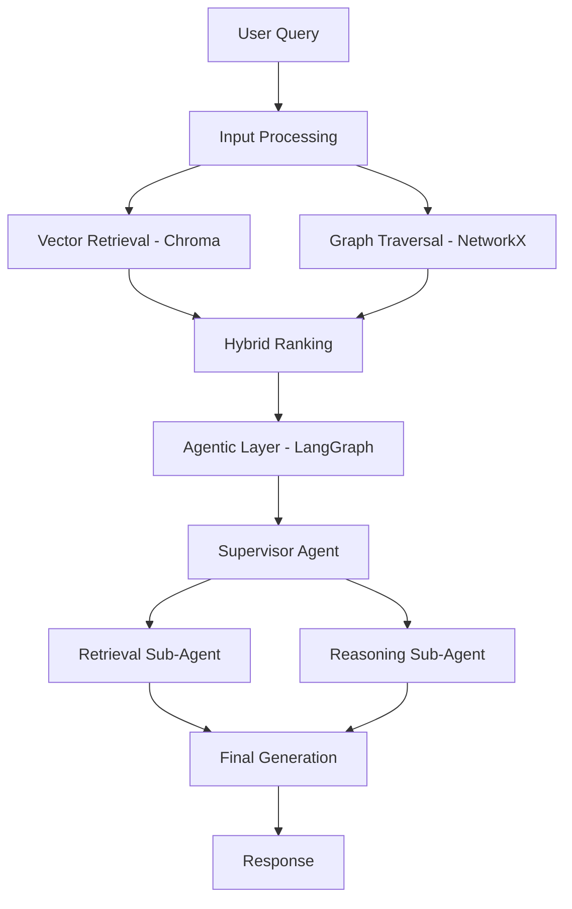
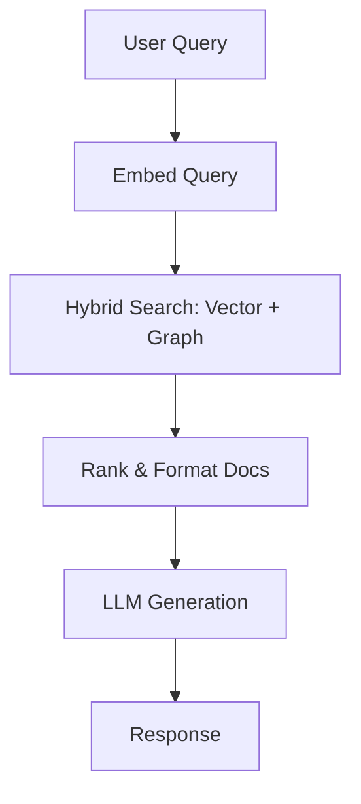
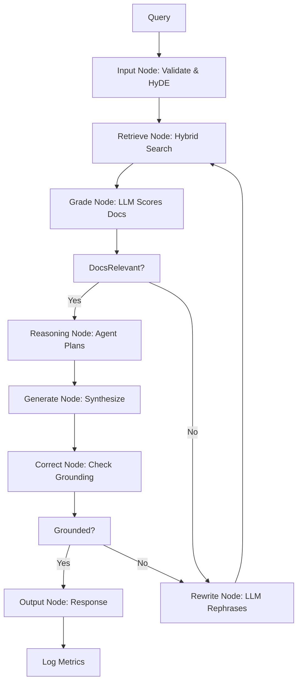

# RAG Product Requirements Document: Graph-Enhanced Agentic RAG for Arxiv Research Agent

## Overview
This PRD details the "Hybrid Retrieval Augmented Generation" system, a sophisticated framework combining vector-based retrieval (via PostgreSQL + pgvector), knowledge graph reasoning (for structured relations like citations via Neo4j), and hierarchical multi-agent orchestration (via LangGraph) to enable deep, faithful reasoning for Arxiv paper queries. The system addresses limitations of vanilla RAG (e.g., surface-level similarity) by modeling domain-specific relations and enabling agentic adaptation.

The RAG works in two modes:
- **Pre-Agent**: A standalone chain for quick, direct retrieval and generation.
- **Agent Tool**: Integrated into LangGraph graphs for iterative, multi-step reasoning in the CLI chatbot and user-triggered automator.

This design ensures robustness, scalability, and alignment with Arxiv's citation-heavy ecosystem, enhancing the overall research agent.

## Key Research Papers and Inspirations
This system draws from cutting-edge Arxiv papers (2024-2025) on advanced RAG, focusing on graph-based and agentic enhancements for improved reasoning and faithfulness:

- **Think-on-Graph 2.0: Deep and Faithful Large Language Model Reasoning with Knowledge-guided Retrieval Augmented Generation** (Arxiv 2407.10805, 2024-2025): Core inspiration for knowledge-guided graph reasoning. It uses graphs to model entity relations (e.g., paper citations, co-authorship) during retrieval, enabling "deep and faithful" generation by conditioning on structured knowledge. Applied here to Arxiv's relational data for better similarity and reasoning.
  
- **HM-RAG: Hierarchical Multi-Agent Multimodal Retrieval Augmented Generation** (Arxiv 2504.12330, 2025): Inspiration for hierarchical multi-agent architecture. It coordinates sub-agents across heterogeneous data for complex queries. Used to structure the agentic layer, allowing supervisor routing and collaborative reasoning in the RAG graph.

Additional context from surveys:
- **Retrieval-Augmented Generation: A Comprehensive Survey of Architectures, Enhancements, and Robustness Frontiers** (Arxiv 2506.00054, 2025): Highlights gaps in multimodal and robustness; this system addresses text-domain robustness via graphs and agents.
- **A Systematic Review of Key Retrieval-Augmented Generation (RAG) Systems** (Arxiv 2507.18910, 2025): Emphasizes agentic and hybrid approaches for industry; informs the dual-mode design.

These papers provide empirical backing for graph-agent hybrids, outperforming vector-only RAG in depth and fidelity.

## Core Architecture
The RAG is a hybrid system with three pillars:
- **Vector Retrieval**: PostgreSQL + pgvector for embedding-based similarity (using Ollama/Gemini).
- **Knowledge Graph**: Neo4j for graph modeling and relationship traversal (papers, authors, citations).
- **Agentic Orchestration**: LangGraph for hierarchical agents (supervisor + sub-agents) handling reasoning and routing.

Components integrate via APIs, with fallbacks for robustness.


```mermaid
graph TD
    A[User Query] --> B[Input Processing]
    B --> C[Vector Retrieval - Chroma]
    B --> D[Graph Traversal - NetworkX]
    C --> E[Hybrid Ranking]
    D --> E
    E --> F[Agentic Layer - LangGraph]
    F --> G[Supervisor Agent]
    G --> H[Retrieval Sub-Agent]
    G --> I[Reasoning Sub-Agent]
    H --> J[Final Generation]
    I --> J
    J --> K[Response]
```

- **Vector Retrieval (Chroma)**: Embeds and stores paper abstracts; performs semantic search.
- **Knowledge Graph (NetworkX)**: Models relations; queries for connected entities.
- **Agentic Layer (LangGraph)**: Nodes for grading, rewriting; edges for conditional flow.
- **Integration**: Shared state across components; LLMs (Ollama primary) for generation/grading.

## Runtime Flow
The flow adapts based on mode and query complexity, with conditional routing for efficiency.

### Pre-Agent Mode (Standalone Chain)
For simple queries: Retrieve → Generate.

```mermaid
flowchart TD
    A[User Query] --> B[Embed Query]
    B --> C[Hybrid Search: Vector + Graph]
    C --> D[Rank & Format Docs]
    D --> E[LLM Generation]
    E --> F[Response]
```

### Agent Tool Mode (LangGraph Graph)
For complex queries: Full reasoning with agents.

```mermaid
flowchart TD
    A[Query] --> B[Input Node: Validate & HyDE]
    B --> C[Retrieve Node: Hybrid Search]
    C --> D[Grade Node: LLM Scores Docs]
    D --> DocsRelevant?
    DocsRelevant? -->|Yes| E[Reasoning Node: Agent Plans]
    DocsRelevant? -->|No| F[Rewrite Node: LLM Rephrases]
    F --> C
    E --> G[Generate Node: Synthesize]
    G --> H[Correct Node: Check Grounding]
    H --> Grounded?
    Grounded? -->|Yes| I[Output Node: Response]
    Grounded? -->|No| F
    I --> J[Log Metrics]
```

- **Key Flows**: Conditional edges (e.g., retry on low relevance); agents handle multi-step (e.g., reasoning sub-agent for citations).
- **Error Handling**: Retries for API failures; interrupts for graph issues.
- **Performance**: Async for retrieval; max 3 rewrites to avoid loops.

## Components and Features
- **Vector Retrieval**: Chroma with Ollama embeddings; hybrid (semantic + keyword).
- **Knowledge Graph**: NetworkX for graphs; key algorithms:
  - **PageRank**: Ranks nodes by importance based on incoming links (citations). Iteratively calculates scores—higher for nodes linked by influential others. Used to rank retrieved papers by citation influence.
  - **Centrality**: Measures node influence (e.g., degree for connections, betweenness for bridges in citation networks).
  - **Shortest Path**: Finds related papers via minimal citation hops. Nodes (papers/authors), edges (citations).
- **Agentic Layer**: Supervisor routes to sub-agents (retrieval, reasoning); Command-based routing in LangGraph.
- **LLM Integration**: Ollama for local; Gemini fallback. Structured prompts for grading/rewriting.
- **Modes**:
  - Pre-Agent: LCEL chain for fast responses.
  - Agent Tool: Full graph for adaptive reasoning.
- **Features**: 
  - Speculative drafting (LLM drafts response to guide retrieval).
  - HyDE (Hypothetical Document Embeddings—generate hypothetical answer via LLM, embed for better document matching).
  - Cascading grading (multi-stage relevance checks).
  - Multimodal-ready (extend for figures).

## Requirements and Tradeoffs
- **Functional**: Retrieve Arxiv papers via vectors/graphs; generate faithful answers; classify/ingest via agents.
- **Non-Functional**: Scalability (1000+ papers); latency (<5s for retrieval); robustness (handle noisy metadata).
- **Dependencies**: langchain_postgres, langchain_neo4j, psycopg2-binary, neo4j-driver, pgvector, langgraph, langchain_ollama.
- **Tradeoffs**:
  - Graph adds depth but complexity/setup time; use NetworkX for simplicity.
  - Agents improve reasoning but increase latency; limit to complex queries.
  - Vector-only fallback if graph sparse.

## Integration with Arxiv Agent
- **CLI**: Pre-agent for "research X" (direct answer). Agent tool: In hybrid_rag_node, call RAG graph if query needs retrieval.
- **Automator**: Agent tool in similarity_node (retrieve similar to liked embeddings for ingestion).
- **Ingestion**: On new papers, embed abstracts; add to PostgreSQL with metadata; build Neo4j relationships.
- **Context Management**: RAG's PostgreSQL can be queried separately for retrieving compressed conversation history (separation of concerns). See CONTEXT_PRD.md for details.
- **Cross-Database Coordination**: Query federation services handle routing and result fusion; sync services maintain consistency between PostgreSQL and Neo4j data.

## Implementation Roadmap
1. Setup: Init PostgreSQL + pgvector, Neo4j, Ollama with cross-database coordination.
2. Core: Build hybrid query federation, sync services, and graph agents.
3. Integration: Plug into CLI/automator with cross-database state management.
4. Testing: Evaluate hybrid RAG queries and Neo4j relationship traversals on Arxiv data.
5. Iteration: Optimize performance and add advanced fusion algorithms with progressive analytics dashboard and user interaction data integration.

## Cross-Database Architecture Implementation
### Hybrid Query Federation Framework
```python
class HybridQueryFederator:
    """Coordinates queries across PostgreSQL and Neo4j with intelligent routing"""
    
    def __init__(self, pg_pool, neo4j_driver):
        self.pg_router = PostgreSQLQueryRouter(pg_pool)
        self.neo4j_router = Neo4jQueryRouter(neo4j_driver)
        self.fusion_engine = ResultFusionEngine()
        self.cache = HybridCache()  # Redis for cross-database caching
        
    async def execute_query(self, query):
        # Route query based on complexity analysis
        routing_decision = await self.analyze_query_routing(query)
        
        if routing_decision['strategy'] == 'hybrid_parallel':
            # Execute both databases in parallel
            pg_task = self.pg_router.vector_search(query, routing_decision['pg_params'])
            neo4j_task = self.neo4j_router.relationship_search(query, routing_decision['neo4j_params'])
            
            pg_results, neo4j_results = await asyncio.gather(pg_task, neo4j_task)
            
            # Fuse results with deduplication and ranking
            fused_results = await self.fusion_engine.fuse_with_cross_reference(
                pg_results, neo4j_results, query
            )
            
            return fused_results
        else:
            # Route to optimal single database
            if routing_decision['strategy'] == 'postgresql_primary':
                return await self.pg_router.complex_search(query, routing_decision['pg_params'])
            elif routing_decision['strategy'] == 'neo4j_primary':
                return await self.neo4j_router.graph_traversal(query, routing_decision['neo4j_params'])
```

### Data Synchronization Services
```python
class CrossDatabaseSyncManager:
    """Maintains consistency between PostgreSQL and Neo4j"""
    
    def __init__(self, pg_pool, neo4j_driver):
        self.pg_pool = pg_pool
        self.neo4j_driver = neo4j_driver
        self.sync_queue = asyncio.Queue()
        self.conflict_resolver = ConflictResolver()
        
    async def sync_paper_relationships(self, paper_id):
        """Sync paper data from PostgreSQL to Neo4j"""
        # Get paper data from PostgreSQL
        paper_data = await self.pg_pool.get_paper_with_relationships(paper_id)
        
        # Create Neo4j relationships
        async with self.neo4j_driver.session() as session:
            # Create/update paper node
            await session.run("""
                MERGE (p:Paper {arxiv_id: $arxiv_id})
                SET p.title = $title, p.abstract = $abstract
                """, arxiv_id=paper_data['arxiv_id'],
                    title=paper_data['title'],
                    abstract=paper_data['abstract'])
            
            # Create citation relationships
            for citation_id in paper_data.get('citations', []):
                await session.run("""
                    MATCH (p:Paper {arxiv_id: $arxiv_id}),
                          (cited:Paper {arxiv_id: $cited_id})
                    MERGE (p)-[:CITES]->(cited)
                    """, arxiv_id=paper_data['arxiv_id'],
                        cited_id=citation_id)
            
            # Create author relationships
            for i, author in enumerate(paper_data.get('authors', [])):
                await session.run("""
                    MERGE (a:Author {name: $name})
                    MERGE (p:Paper {arxiv_id: $arxiv_id})
                    MERGE (a)-[:AUTHORED {position: $position}]->(p)
                    """, name=author['name'],
                        arxiv_id=paper_data['arxiv_id'],
                        position=i+1)
        
        # Update sync status in PostgreSQL
        await self.pg_pool.update_sync_status(paper_id, 'synced')
```

### Performance Optimization Layer
```python
class HybridPerformanceOptimizer:
    """Optimizes performance across hybrid database system"""
    
    def __init__(self):
        self.query_cache = {}  # LRU cache for frequent queries
        self.performance_metrics = PerformanceMetrics()
        
    async def optimize_query_execution(self, query):
        # Check cache first
        if query in self.query_cache:
            return self.query_cache[query]
        
        # Analyze query pattern for optimization
        query complexity = self.analyze_query_complexity(query)
        
        # Choose optimal execution strategy
        if complexity['cache_friendly']:
            return await self.cached_execution(query)
        else:
            return await self.fresh_execution(query)
        
    async def batch_optimize_database_operations(self, operations):
        # Batch operations for better performance
        # Group operations by type and database
        pg_batches = self.group_postgres_operations(operations)
        neo4j_batches = self.group_neo4j_operations(operations)
        
        # Execute batches in parallel where possible
        await asyncio.gather(
            self.execute_postgres_batch(pg_batches),
            self.execute_neo4j_batch(neo4j_batches)
        )
```


This RAG elevates the agent with paper-inspired sophistication. Reference PRD.md for overall system integration.