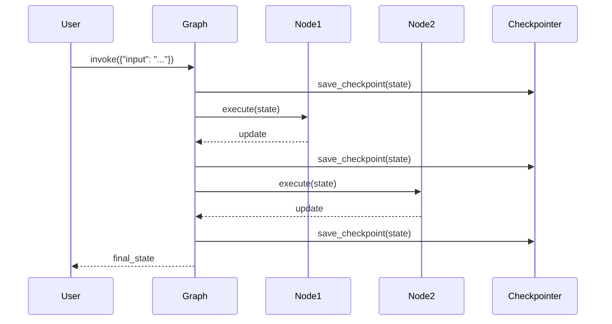

# LangGraph Architecture

## Core Design Principles

### 1.1 Central Philosophy

LangGraph is built around the concept of **stateful graphs** for LLM applications. Unlike linear chains, LangGraph allows for:

- **Cycles**: Essential for agentic behavior where the agent can decide to use tools again
- **Branching**: Parallel execution and conditional paths
- **Persistence**: Checkpointing state for recovery and time travel
- **Multi-Agent Coordination**: Patterns for agent collaboration

### 1.2 Key Design Principles

| Principle | Description |
|-----------|-------------|
| **Graph-Based** | Applications as directed graphs with nodes and edges |
| **Typed State** | State defined via TypedDict for type safety |
| **Checkpointing** | Automatic state persistence for resumption |
| **Cycles First** | Designed for iterative agent behavior |
| **Human-in-the-Loop** | Breakpoints for human intervention |
| **Multi-Agent** | Built-in patterns for agent collaboration |

---

## System Architecture

### 2.1 High-Level Overview

The LangGraph architecture consists of several layers:

```
┌─────────────────────────────────────────────────────────────┐
│                    User Interface Layer                      │
│        (CLI, API, Web Server, Programmatic API)             │
├─────────────────────────────────────────────────────────────┤
│                     Graph Layer                              │
│              (StateGraph, Nodes, Edges)                     │
├───────────────┬─────────────────────┬───────────────────────┤
│    State      │     Checkpointer    │     Compiler          │
│  (TypedDict)  │   (Persistence)     │   (Graph Assembly)    │
├───────────────┴─────────────────────┴───────────────────────┤
│                  Execution Runtime                           │
│              (Node execution, Edge routing)                  │
├─────────────────────────────────────────────────────────────┤
│                    LangChain Integration                     │
│         (LLMs, Tools, Messages, Prompts)                    │
└─────────────────────────────────────────────────────────────┘
```

### 2.2 Component Details

#### StateGraph

The main graph class that orchestrates the application:

```python
from typing import TypedDict
from langgraph.graph import StateGraph, END

class AgentState(TypedDict):
    messages: list[str]
    context: dict
    result: str | None

graph = StateGraph(AgentState)

# Add nodes
graph.add_node("process", process_node)
graph.add_node("analyze", analyze_node)
graph.add_node("respond", respond_node)

# Define flow
graph.set_entry_point("process")
graph.add_edge("process", "analyze")
graph.add_edge("analyze", "respond")
graph.add_edge("respond", END)
```

#### Nodes

Python functions that transform state:

```python
from typing import TypedDict

def process_node(state: AgentState) -> AgentState:
    """Process user input and extract key information"""
    return {
        "messages": state["messages"],
        "context": {"input": state["messages"][-1]},
        "result": None
    }

def analyze_node(state: AgentState) -> AgentState:
    """Analyze the input and determine response strategy"""
    return {
        "messages": state["messages"],
        "context": state["context"],
        "result": "Analysis complete"
    }
```

#### Edges

Define how control flows between nodes:

```python
from langgraph.graph import END

# Direct edge
graph.add_edge("process", "analyze")

# Conditional edge
graph.add_conditional_edges(
    "analyze",
    should_continue,  # Router function
    {
        "continue": "respond",
        "end": END
    }
)
```

#### Checkpointer

Enables state persistence:

```python
from langgraph.checkpoint.memory import MemorySaver

# Memory-based checkpointer (ephemeral)
memory = MemorySaver()

# SQLite checkpointer (persistent)
from langgraph.checkpoint.sqlite import SqliteSaver
sqlite = SqliteSaver.from_conn_string("checkpoints.db")

# PostgreSQL checkpointer (distributed)
from langgraph.checkpoint.postgres import PostgresSaver
postgres = PostgresSaver.from_conn_string("postgresql://...")

app = graph.compile(checkpointer=sqlite)
```

---

## State Management Architecture

### 3.1 State Definition

State is defined as a TypedDict:

```python
from typing import TypedDict, List, NotRequired, TypedDict

class AgentState(TypedDict):
    # Required fields
    input: str
    messages: List[str]
    
    # Optional fields
    context: dict
    result: str | None
    confidence: NotRequired[float]
```

### 3.2 State Updates

Nodes return partial state updates:

```python
def node_a(state: AgentState) -> AgentState:
    # Return only the fields to update
    return {"result": "processed", "context": {"source": "node_a"}}

def node_b(state: AgentState) -> AgentState:
    # Multiple updates
    return {
        "result": "analyzed",
        "confidence": 0.95,
        "context": {"analysis": "complete"}
    }
```

### 3.3 Reducer Functions

Custom reducers for complex state updates:

```python
from typing import TypedDict
from langgraph.graph import add_messages

class ConversationState(TypedDict):
    messages: Annotated[list[str], add_messages]
    metadata: dict

def conversation_node(state: ConversationState) -> ConversationState:
    return {"messages": ["New assistant message"], "metadata": {"node": "agent"}}
```

---

## Graph Execution Model

### 4.1 Execution Flow



### 4.2 Streaming

```python
# Stream individual node outputs
for chunk in app.stream({"input": "hello"}):
    print(chunk)

# Stream tokens from LLM nodes
async for event in app.astream_events({"input": "hello"}, version="v1"):
    kind = event["event"]
    if kind == "on_chat_model_stream":
        print(event["data"]["chunk"].content, end="", flush=True)
```

### 4.3 Interruptions and Breakpoints

```python
from langgraph.graph import StateGraph, END, START

graph = StateGraph(AgentState)
graph.add_node("process", process_node)
graph.add_node("analyze", analyze_node)
graph.add_node("respond", respond_node)
graph.add_node("human_review", human_review_node)

graph.set_entry_point("process")
graph.add_edge("process", "analyze")
graph.add_conditional_edges(
    "analyze",
    should_escalate,
    {"human": "human_review", "continue": "respond"}
)
graph.add_edge("human_review", "respond")
graph.add_edge("respond", END)

app = graph.compile(
    interrupt_before=["human_review"],
    checkpointer=memory
)

# Run until breakpoint
result = app.invoke({"input": "..."})

# Human review happens here
# Resume after review
result = app.invoke(None, config=config)
```

---

## Data Models

### 4.1 State Structure

```python
class AgentState(TypedDict):
    messages: List[BaseMessage]          # Conversation messages
    context: Dict[str, Any]              # Additional context
    intermediate_steps: List[Tuple[...]] # Tool execution history
    result: str | None                   # Final result
    metadata: Dict[str, Any]             # Graph metadata
```

### 4.2 Checkpoint Structure

```python
class Checkpoint:
    """Represents a saved state of the graph"""
    checkpoint_id: str                   # Unique identifier
    state: AgentState                    # Saved state
    metadata: Dict[str, Any]             # Checkpoint metadata
    created_at: datetime                 # When checkpoint was created
    parent_checkpoint_id: str | None     # For time travel
```

### 4.3 Configuration

```python
from langchain_core.runnables import RunnableConfig

config = RunnableConfig(
    configurable={
        "thread_id": "session_123",
        "checkpoint_id": "checkpoint_abc"
    },
    recursion_limit=25,
    max_concurrency=5
)

result = app.invoke(state, config=config)
```

---

## Tool Integration

### 5.1 Tool Definition

```python
from langchain_core.tools import tool, BaseTool

@tool
def search_arxiv(query: str, max_results: int = 5) -> str:
    """Search arXiv for papers matching the query"""
    # Implementation
    return "Paper results..."

@tool
def analyze_paper(paper_id: str) -> dict:
    """Analyze a paper and extract key information"""
    # Implementation
    return {"title": "...", "abstract": "..."}
```

### 5.2 Tool Execution in Nodes

```python
from langchain_core.messages import HumanMessage
from langgraph.prebuilt import ToolNode, create_tool_calling_executor

# Pre-built tool calling
tool_node = ToolNode([search_arxiv, analyze_paper])

def agent_node(state: AgentState) -> AgentState:
    messages = state["messages"]
    response = llm_with_tools.invoke(messages)
    return {"messages": [response]}
```

### 5.3 Custom Tool Nodes

```python
def research_node(state: AgentState) -> AgentState:
    """Custom node that uses multiple tools"""
    query = state["context"]["query"]
    
    # Search arXiv
    arxiv_results = search_arxiv(query)
    
    # Analyze top results
    for paper in arxiv_results[:3]:
        analysis = analyze_paper(paper["id"])
        # Process analysis
    
    return {
        "messages": state["messages"],
        "context": {"research": "complete"},
        "result": summary
    }
```

---

## Multi-Agent Patterns

### 6.1 Supervisor Pattern

```python
from typing import TypedDict, Literal
from langgraph.graph import StateGraph, END, START

class SupervisorState(TypedDict):
    task: str
    subtask: str | None
    result: str | None
    agent: Literal["researcher", "coder", "reviewer"] | None

def supervisor(state: SupervisorState) -> SupervisorState:
    task = state["task"].lower()
    
    if "research" in task or "search" in task:
        return {"task": task, "agent": "researcher"}
    elif "code" in task or "implement" in task:
        return {"task": task, "agent": "coder"}
    elif "review" in task or "check" in task:
        return {"task": task, "agent": "reviewer"}
    else:
        return {"task": task, "agent": None, "result": "Cannot determine agent"}

graph = StateGraph(SupervisorState)
graph.add_node("supervisor", supervisor)
graph.add_node("researcher", researcher_agent)
graph.add_node("coder", coder_agent)
graph.add_node("reviewer", reviewer_agent)

graph.set_entry_point("supervisor")
graph.add_conditional_edges(
    "supervisor",
    lambda state: state["agent"],
    {
        "researcher": "researcher",
        "coder": "coder",
        "reviewer": "reviewer",
        "END": END
    }
)
graph.add_edge("researcher", "supervisor")
graph.add_edge("coder", "supervisor")
graph.add_edge("reviewer", "supervisor")
```

### 6.2 LangGraph Supervisor Library

In February 2025, LangChain released **langgraph-supervisor**, a lightweight Python library that simplifies building hierarchical multi-agent systems with LangGraph. This library provides higher-level abstractions for supervisor-worker patterns:

**Key Features:**
- Single supervisor (orchestrator) agent handles all user interactions
- Supervisor delegates tasks to worker agents
- Worker agents communicate exclusively with the supervisor
- Support for multiple hierarchical levels (supervisors of supervisors)

**Installation:**
```bash
pip install langgraph-supervisor
```

**Basic Usage:**
```python
from langgraph_supervisor import create_supervisor

# Create supervisor with worker agents
supervisor = create_supervisor(
    agents=[research_agent, coder_agent, reviewer_agent],
    model=llm
)

# Compile and use
app = supervisor.compile()
```

The langgraph-supervisor library is recommended for projects requiring quick setup of hierarchical multi-agent systems with minimal boilerplate.

### 6.3 Custom Agent Implementation

```python
from langchain_core.messages import SystemMessage
from langchain_openai import ChatOpenAI

def create_agent(system_prompt: str, tools: list) -> Callable:
    llm = ChatOpenAI(model="gpt-4o")
    llm_with_tools = llm.bind_tools(tools)
    
    def agent(state: AgentState) -> AgentState:
        messages = [SystemMessage(content=system_prompt)] + state["messages"]
        response = llm_with_tools.invoke(messages)
        return {"messages": [response], "result": response.content}
    
    return agent

researcher = create_agent(
    system_prompt="You are a research assistant. Search and analyze papers.",
    tools=[search_arxiv, analyze_paper]
)
```

---

## Comparison with Other Frameworks

### 7.1 vs LangChain Chains

| Aspect | LangGraph | LangChain Chains |
|--------|-----------|------------------|
| Architecture | Graph with cycles | Linear sequences |
| State | Explicit TypedDict | Implicit in callbacks |
| Persistence | Built-in checkpointers | Custom implementation |
| Cycles | First-class support | Not natural |
| Use Case | Agents, workflows | Simple pipelines |

### 7.2 vs Autogen

| Aspect | LangGraph | AutoGen |
|--------|-----------|---------|
| Multi-Agent | Graph-based | Conversation-based |
| Persistence | Checkpointers | Session-based |
| Flexibility | High (custom nodes) | Agent-based |
| Learning Curve | Moderate | Lower |
| Production Ready | Yes | Growing |

### 7.3 vs CrewAI

| Aspect | LangGraph | CrewAI |
|--------|-----------|--------|
| Architecture | Generic graph | Agent-centric |
| State Management | Explicit | Implicit |
| Persistence | Checkpointers | Custom |
| Customization | Full Python | YAML/Code |
| Debugging | Clear traces | Limited |

---

## Summary

The LangGraph architecture is designed for:

- **Complex Workflows**: Cycles, branches, and parallel execution
- **Persistence**: Checkpointing for reliability and time travel
- **Multi-Agent Systems**: Supervisor and collaboration patterns
- **Production Use**: Robust error handling and streaming
- **Flexibility**: Full Python control over execution

The modular design allows users to:
- Define custom nodes with any Python logic
- Implement complex routing with conditional edges
- Persist state for long-running workflows
- Integrate with any LangChain component
- Build multi-agent systems with clear coordination

---

*Document Version: 1.0*
*Last Updated: January 2026*
*Source: LangGraph Documentation and Architecture*
