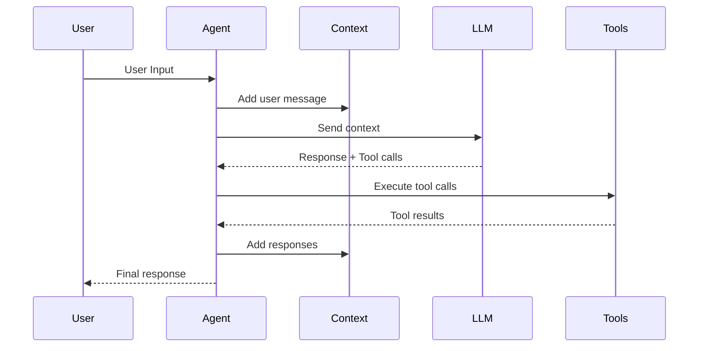

# Orchestral AI Architecture

## Core Design Principles

**Source: arXiv Paper "Orchestral AI: A Framework for Agent Orchestration" (2601.02577)**

### 1.1 Central Philosophy

Orchestral addresses the fundamental tension in LLM agent frameworks between:
- **Vendor Lock-in**: Provider-specific SDKs offer depth but create dependencies
- **Architectural Complexity**: Multi-package ecosystems obscure control flow

**Orchestral's Solution:** A unified, type-safe interface that operates seamlessly across all major LLM providers while maintaining simplicity for both scientific computing and production deployment.

### 1.2 Key Design Principles

| Principle | Description |
|-----------|-------------|
| **Provider Agnosticism** | Write once, run anywhere across OpenAI, Anthropic, Google, Groq, Mistral, AWS Bedrock, Ollama |
| **Deterministic Execution** | Synchronous execution model ensures reproducibility |
| **Type Safety** | Automatic schema generation from Python type hints |
| **Minimal Complexity** | Single Python package with minimal dependencies |
| **Extensibility** | Clean separation enables customization without architectural entanglement |

---

## System Architecture

### 2.1 High-Level Overview

The Orchestral framework architecture consists of four main layers:

```
┌─────────────────────────────────────────────────────────────┐
│                    User Interface Layer                      │
│        (CLI, Web Server, Programmatic API)                  │
├─────────────────────────────────────────────────────────────┤
│                     Agent Layer                              │
│              (Orchestration & Coordination)                  │
├───────────────┬─────────────────────┬───────────────────────┤
│    LLM Layer  │     Tools Layer     │     Context Layer     │
│  (Provider    │  (Execution & Hooks)│  (State Management)   │
│   Abstraction)│                     │                       │
├───────────────┴─────────────────────┴───────────────────────┤
│                 Provider Integration Layer                   │
│         (OpenAI, Anthropic, Google, Groq, etc.)             │
└─────────────────────────────────────────────────────────────┘
```

### 2.2 Component Details

#### Agent Layer

The **Agent class** serves as the central orchestrator:

```python
from orchestral import Agent
from orchestral.llm import Claude

agent = Agent(
    llm=Claude(model='claude-sonnet-4-0'),
    system_prompt="You are a helpful assistant."
)
```

**Responsibilities:**
- Coordinate LLM, tools, and context
- Manage execution flow (synchronous/streaming)
- Handle multi-turn conversations
- Track costs and usage

#### LLM Layer

**Provider abstraction** with unified interface:

```python
from orchestral.llm import Claude, GPT, Gemini, Ollama, Groq

# All providers use the same interface
llm1 = Claude(model='claude-sonnet-4-0')
llm2 = GPT(model='gpt-4o')
llm3 = Gemini(model='gemini-2.0-flash-exp')
llm4 = Ollama(model='llama3.1:70b')
llm5 = Groq(model='llama-3.1-70b-versatile')
```

**Benefits:**
- Identical API across providers
- Automatic format conversion
- Unified cost tracking
- Easy provider switching

#### Tools Layer

**Type-safe tool framework** with automatic schema generation:

```python
from orchestral import define_tool

@define_tool()
def calculate_energy(mass: float, c: float = 299792458.0):
    """Calculate relativistic energy using E=mc²
    
    Args:
        mass: Mass in kilograms
        c: Speed of light in m/s (default: exact value)
    
    Returns:
        Energy in joules
    """
    energy = mass * c ** 2
    return f"E = mc² = {energy:.3e} joules"
```

**Features:**
- Automatic schema generation from type hints
- Pre/post execution hooks for security
- Input validation across provider boundaries
- Sandbox execution via workspace isolation

#### Context Layer

**Conversation state management:**

```python
from orchestral.context import Context

# Load existing context
context = Context.load_json("conversation.json")

# Save current context
agent.context.save_json("conversation.json")
```

**Responsibilities:**
- Store message history
- Validate conversation integrity
- Track token usage and costs
- Enable persistence across sessions

---

## Message Flow

### 3.1 Synchronous Execution Flow



### 3.2 Execution Steps

1. **Input Processing**: User message added to Context
2. **Context Serialization**: Unified format converted to provider-specific format
3. **LLM Processing**: Provider processes the request
4. **Response Parsing**: Provider response parsed back to unified Message format
5. **Tool Execution**: If tool calls exist, execute and validate
6. **Context Update**: Results added to conversation history
7. **Output**: Final response returned to user

### 3.3 Streaming Flow

```python
# Real-time token-by-token streaming
for chunk in agent.stream_text_message("Write a story..."):
    print(chunk, end='', flush=True)
```

**Benefits:**
- No waiting for complete response
- Early error detection
- Better user experience

---

## Data Models

### 4.1 Message Structure

**Universal representation** (works across all providers):

```python
class Message:
    role: str                      # "user", "assistant", "system", "tool"
    content: str                   # Text content
    tool_calls: List[ToolCall]     # LLM-suggested tool invocations
    tool_results: List[ToolResult] # Results from executed tools
    usage: Usage                   # Token usage for this message
    metadata: Dict[str, Any]       # Provider-specific metadata
```

### 4.2 Tool Schema

**Automatically generated from Python type hints:**

```python
class ToolSchema:
    name: str                      # Tool identifier
    description: str               # Human-readable description
    parameters: Dict[str, Field]   # Parameter specifications
    return_type: Type              # Return value type
```

### 4.3 Usage Tracking

```python
class Usage:
    input_tokens: int              # Tokens in request
    output_tokens: int             # Tokens in response
    cost: float                    # Estimated cost in USD
```

---

## Provider Integration Architecture

### 5.1 Abstraction Layer

The provider layer abstracts differences between LLM services:

```python
class BaseLLM:
    def complete(self, context: Context, stream: bool = False) -> Response:
        """Process context and return response"""
        
    def get_cost(self, usage: Usage) -> float:
        """Calculate cost for given usage"""
```

### 5.2 Supported Providers

| Provider | Models | API Type |
|----------|--------|----------|
| **Anthropic** | Claude Sonnet, Haiku, Opus | REST |
| **OpenAI** | GPT-4, GPT-4o, GPT-3.5 | REST |
| **Google** | Gemini Pro, Flash | REST |
| **Groq** | Llama, Mixtral | REST |
| **Mistral AI** | Mixtral, Mistral | REST |
| **AWS Bedrock** | Claude, Titan | SDK |
| **Ollama** | Local models | Local |

### 5.3 Format Conversion

**Input Processing:**
```
Context (Unified) → Provider-Specific Format → API Request
```

**Output Processing:**
```
API Response → Unified Message Format → Context
```

---

## Tool Execution Architecture

### 6.1 Hook System

Security and monitoring via pre/post execution hooks:

```python
from orchestral.tools.hooks import (
    UserApprovalHook,       # Require approval for sensitive operations
    DangerousCommandHook(), # Block dangerous patterns (rm -rf, eval(), etc.)
    TruncateLinesHook(),    # Limit output size
    SafeguardHook()         # Additional safety measures
)

hooks = [
    UserApprovalHook(),
    DangerousCommandHook(),
    TruncateLinesHook(),
]

agent = Agent(llm=llm, tools=tools, tool_hooks=hooks)
```

### 6.2 Execution Flow

```
LLM Response (Tool Call)
    ↓
Pre-Hooks Execute
    ├── Security Check
    ├── Input Validation
    └── Approval Request (if needed)
    ↓
Tool Execution
    ├── Sandbox Isolation
    ├── Input Processing
    └── Function Execution
    ↓
Post-Hooks Execute
    ├── Output Processing
    ├── Result Validation
    └── Cost Tracking
    ↓
Context Update
```

---

## Context Management Architecture

### 7.1 Context Responsibilities

1. **Message Storage**: Conversation history with validation
2. **Integrity Protection**: Detect external modifications
3. **Usage Tracking**: Token and cost monitoring
4. **Persistence**: Save/load conversations

### 7.2 Context Methods

```python
class Context:
    messages: List[Message]    # Conversation history
    usage: Usage              # Aggregated usage
    metadata: Dict[str, Any]  # Additional data
    
    def add_message(self, message: Message):
        """Add and validate message"""
        
    def remove_orphaned_tool_results(self):
        """Clean unmatched tool results"""
        
    def save_json(self, path: str):
        """Serialize entire conversation"""
        
    @classmethod
    def load_json(cls, path: str) -> 'Context':
        """Load conversation from file"""
```

### 7.3 Persistence Options

**Current (v1.0):**
- JSON file storage via `save_json()`/`load_json()`

**Future Directions:**
- Redis backend (requires custom implementation)
- PostgreSQL backend (requires custom implementation)
- Cloud storage integration

---

## Design Decisions

### 8.1 Synchronous Execution Model

**Decision:** Use synchronous execution with streaming support rather than async/await.

**Rationale:**
- Deterministic behavior for reproducibility
- Straightforward control flow
- Better integration with research workflows
- Streaming via generators provides real-time feedback

### 8.2 Type-Safe Tool Generation

**Decision:** Automatic schema generation from Python type hints.

**Rationale:**
- Eliminates manual JSON descriptor writing
- Type safety across provider boundaries
- Familiar Pythonic developer experience
- Single source of truth for types

### 8.3 Single Package Architecture

**Decision:** Keep framework in a single lightweight Python package.

**Rationale:**
- No multi-package complexity like LangChain
- Easy embedding in research projects
- Minimal dependency footprint
- Researchers can comprehend entire codebase

### 8.4 Provider Agnosticism

**Decision:** Unified interface across all providers.

**Rationale:**
- No vendor lock-in
- Easy cost comparison across providers
- Simple provider swapping
- Future-proof architecture

---

## Comparison with Other Frameworks

### 9.1 vs LangChain

| Aspect | Orchestral | LangChain |
|--------|-----------|-----------|
| Architecture | Single package | Multi-package ecosystem |
| Complexity | Low | High |
| Debugging | Straightforward | Complex abstractions |
| Provider Support | Unified interface | Extensive but fragmented |
| Use Case | Research + Production | Enterprise focus |

### 9.2 vs Claude Agent SDK

| Aspect | Orchestral | Claude Agent SDK |
|--------|-----------|------------------|
| Provider Support | Multi-provider | Anthropic only |
| Deployment | Lightweight | IDE-centric |
| Architecture | Explicit control flow | Hidden complexity |
| Research Features | Built-in | Limited |
| Reproducibility | High | Medium |

### 9.3 vs CrewAI

| Aspect | Orchestral | CrewAI |
|--------|-----------|--------|
| Multi-Agent | Supported | Primary focus |
| Debugging | Clear stack traces | Poor logging |
| Production Ready | Yes | Requires additional work |
| Research Integration | Specialized | General purpose |

---

## Summary

The Orchestral AI architecture is designed to balance:
- **Simplicity** for researchers and beginners
- **Power** for production deployments
- **Flexibility** across providers and use cases
- **Type Safety** for reliable tool execution
- **Security** via layered hooks and sandboxing

The modular design allows users to:
- Swap LLM providers without code changes
- Add custom tools with automatic schema generation
- Implement security policies via hooks
- Persist conversations for reproducibility

---

*Document Version: 1.0*
*Last Updated: January 2026*
*Source: arXiv Paper 2601.02577*
