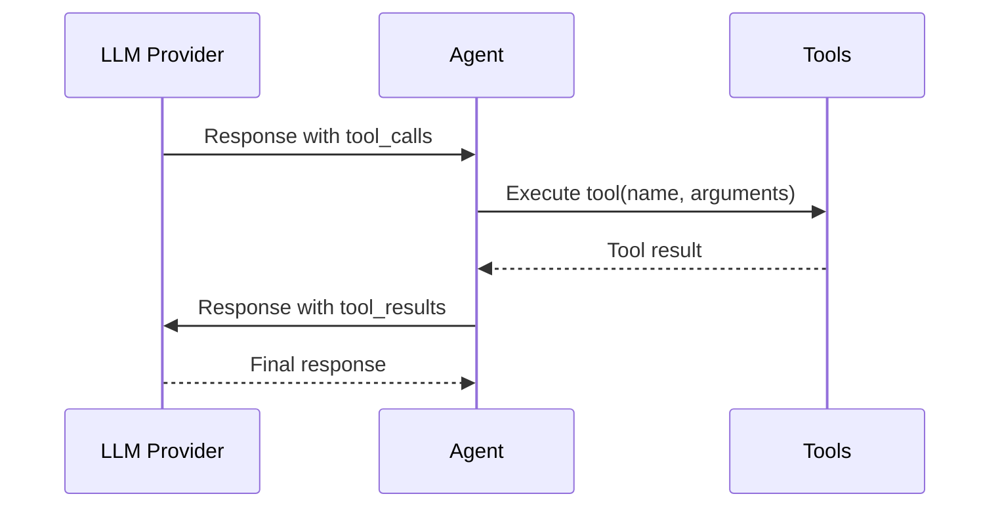

# Orchestral AI Messages

## Overview

Orchestral AI defines a **universal message representation** that works seamlessly across all LLM providers. This abstraction eliminates the need for provider-specific message formatting.

**Source: Orchestral AI Documentation and arXiv Paper 2601.02577**

---

## Message Types

### 1.1 Message Roles

| Role | Description | Example |
|------|-------------|---------|
| `system` | System prompt and instructions | "You are a helpful assistant." |
| `user` | User input and queries | "Help me analyze this data." |
| `assistant` | LLM responses and tool calls | "I'll search for that..." |
| `tool` | Results from tool executions | "Search found 5 results." |

### 1.2 Message Structure

```python
class Message:
    role: str                      # "user", "assistant", "system", "tool"
    content: str                   # Text content
    tool_calls: List[ToolCall]     # LLM-suggested tool invocations
    tool_results: List[ToolResult] # Results from executed tools
    usage: Usage                   # Token usage for this message
    metadata: Dict[str, Any]       # Provider-specific metadata
```

### 1.3 Example Messages

**User Message:**
```python
user_message = Message(
    role="user",
    content="Calculate the energy of a 1kg mass",
    tool_calls=[],
    tool_results=[],
    usage=Usage(input_tokens=15, output_tokens=0, cost=0.0),
    metadata={}
)
```

**Assistant Message with Tool Call:**
```python
assistant_message = Message(
    role="assistant",
    content="I'll calculate that for you.",
    tool_calls=[
        ToolCall(
            id="call_123",
            name="calculate_energy",
            arguments={"mass": 1.0, "c": 299792458.0}
        )
    ],
    tool_results=[],
    usage=Usage(input_tokens=20, output_tokens=30, cost=0.001),
    metadata={}
)
```

**Tool Result Message:**
```python
tool_message = Message(
    role="tool",
    content="",
    tool_calls=[],
    tool_results=[
        ToolResult(
            call_id="call_123",
            name="calculate_energy",
            result="E = mc² = (1.0 kg) × (299792458.0 m/s)² = 8.987e+17 joules"
        )
    ],
    usage=Usage(input_tokens=50, output_tokens=10, cost=0.0005),
    metadata={}
)
```

---

## Universal Message Format

### 2.1 Abstraction Layer

```
┌─────────────────────────────────────────────────────────────┐
│                 Orchestral Message (Unified)                │
├─────────────────────────────────────────────────────────────┤
│                                                             │
│  - Same format for all providers                           │
│  - Provider-specific conversion on input/output             │
│  - Preserves all metadata and tool information              │
│                                                             │
└─────────────────────────────────────────────────────────────┘
                           ↓
┌─────────────────────────────────────────────────────────────┐
│                 Provider-Specific Format                    │
├─────────────────────────────────────────────────────────────┤
│                                                             │
│  OpenAI: [{"role": "user", "content": "..."}]              │
│  Anthropic: [{"role": "user", "content": "..."}]           │
│  Google: {"contents": [{"role": "user", "parts": [...]}]}  │
│                                                             │
└─────────────────────────────────────────────────────────────┘
```

### 2.2 Format Conversion

**Input Processing:**
```python
# Unified context → Provider format
def to_provider_format(context: Context, provider: str) -> Any:
    if provider == "openai":
        return [
            {"role": msg.role, "content": msg.content}
            for msg in context.messages
        ]
    elif provider == "anthropic":
        return [
            {"role": msg.role, "content": msg.content}
            for msg in context.messages
        ]
    # ... other providers
```

**Output Processing:**
```python
# Provider response → Unified message
def from_provider_format(response: Any, provider: str) -> Message:
    if provider == "openai":
        return Message(
            role="assistant",
            content=response.choices[0].message.content,
            tool_calls=response.choices[0].message.tool_calls,
            usage=extract_usage(response),
            metadata={}
        )
    # ... other providers
```

---

## Tool Calls and Results

### 3.1 Tool Call Structure

```python
class ToolCall:
    id: str                      # Unique identifier
    name: str                    # Tool function name
    arguments: Dict[str, Any]    # Arguments from LLM
```

### 3.2 Tool Result Structure

```python
class ToolResult:
    call_id: str                 # Matches ToolCall.id
    name: str                    # Tool function name
    result: str                  # Execution result
    error: Optional[str]         # Error message if failed
```

### 3.3 Tool Execution Flow



---

## Usage Tracking

### 4.1 Usage Structure

```python
class Usage:
    input_tokens: int            # Tokens in request
    output_tokens: int           # Tokens in response
    cost: float                  # Estimated cost in USD
```

### 4.2 Aggregated Usage

```python
# Context tracks aggregated usage
total_input = sum(msg.usage.input_tokens for msg in context.messages)
total_output = sum(msg.usage.output_tokens for msg in context.messages)
total_cost = sum(msg.usage.cost for msg in context.messages)

print(f"Total input tokens: {total_input}")
print(f"Total output tokens: {total_output}")
print(f"Total cost: ${total_cost:.4f}")
```

### 4.3 Token Estimation

Different providers use different tokenizers:

```python
# Approximate token counts (actual varies by provider)
def estimate_tokens(text: str) -> int:
    # Rough estimate: 4 characters per token
    return len(text) // 4

# More accurate: Use provider-specific tokenizers
# OpenAI: tiktoken
# Anthropic: cl100k_base (similar to GPT-4)
# Google: Google's tokenizer
```

---

## Message Validation

### 5.1 Validation Rules

1. **Role must be valid**: One of ["system", "user", "assistant", "tool"]
2. **Content required**: For user and assistant messages
3. **Tool calls match results**: Every tool call must have a result
4. **No orphaned results**: Tool results must match tool calls

### 5.2 Validation Example

```python
def validate_context(context: Context) -> bool:
    """Validate message sequence integrity"""
    
    # Check for orphaned tool results
    call_ids = set()
    for msg in context.messages:
        for call in msg.tool_calls:
            call_ids.add(call.id)
    
    result_ids = set()
    for msg in context.messages:
        for result in msg.tool_results:
            result_ids.add(result.call_id)
    
    orphaned = result_ids - call_ids
    if orphaned:
        raise ValueError(f"Orphaned tool results: {orphaned}")
    
    # Check message order
    # System → User → Assistant → Tool → Assistant → ...
    
    return True
```

---

## Streaming Messages

### 6.1 Streaming Response

```python
from orchestral import Agent
from orchestral.llm import Claude

agent = Agent(llm=Claude(), system_prompt="You are helpful.")

# Stream response token by token
for chunk in agent.stream_text_message("Write a story..."):
    print(chunk, end='', flush=True)
```

### 6.2 Streaming Structure

```python
# Chunks are accumulated into complete message
def stream_handler():
    chunks = []
    for chunk in agent.stream_text_message("Query"):
        chunks.append(chunk)
        # Partial rendering possible
    
    # Complete message available after streaming
    full_message = ''.join(chunks)
```

---

## Message Metadata

### 7.1 Metadata Fields

```python
class Message:
    # ... core fields ...
    metadata: Dict[str, Any] = {
        "timestamp": "2026-01-30T10:00:00Z",
        "provider": "claude-sonnet-4-0",
        "model": "claude-sonnet-4-0",
        "stop_reason": "stop",
        "custom_fields": {}
    }
```

### 7.2 Provider-Specific Metadata

| Provider | Metadata Fields |
|----------|-----------------|
| OpenAI | stop_reason, finish_reason |
| Anthropic | stop_reason, delta type |
| Google | finish_reason, grounding metadata |
| Groq | stop_reason |

---

## Context Serialization

### 8.1 JSON Format

```python
# Save context to JSON
agent.context.save_json("conversation.json")

# JSON structure
{
  "messages": [
    {
      "role": "user",
      "content": "Hello",
      "tool_calls": [],
      "tool_results": [],
      "usage": {
        "input_tokens": 10,
        "output_tokens": 0,
        "cost": 0.0
      },
      "metadata": {
        "timestamp": "2026-01-30T10:00:00Z",
        "provider": "claude-sonnet-4-0"
      }
    }
  ],
  "usage": {
    "total_cost": 0.05,
    "total_input_tokens": 1000,
    "total_output_tokens": 5000
  },
  "metadata": {
    "created_at": "2026-01-30T10:00:00Z"
  }
}
```

### 8.2 Cross-Provider Compatibility

**Important:** Message format is provider-agnostic, allowing:
- Create conversation with Claude
- Continue with GPT
- Load old conversation with different provider

```python
# Save with Claude
agent_claude = Agent(llm=Claude(), tools=tools)
agent_claude.context.save_json("conversation.json")

# Continue with GPT
context = Context.load_json("conversation.json")
agent_gpt = Agent(llm=GPT(model='gpt-4o'), tools=tools, context=context)
# Context loads successfully with all message history
```

---

## Multi-Modal Messages

### 9.1 Text Messages

```python
text_message = Message(
    role="user",
    content="Analyze this text: 'Hello world'",
    tool_calls=[],
    tool_results=[],
    usage=Usage(input_tokens=10, output_tokens=0, cost=0.0),
    metadata={}
)
```

### 9.2 Image Messages (Future)

```python
# Orchestral AI doesn't yet have native image support
# For now, use URLs or base64 encoding in content

image_message = Message(
    role="user",
    content="Analyze this image: ",
    tool_calls=[],
    tool_results=[],
    usage=Usage(input_tokens=100, output_tokens=0, cost=0.0),
    metadata={}
)
```

---

## Best Practices

### 10.1 Message Management

1. **Keep messages focused**: Each message should have clear purpose
2. **Manage context length**: Avoid exceeding token limits
3. **Track usage**: Monitor costs per message
4. **Preserve history**: Don't lose important conversation

### 10.2 Tool Call Best Practices

1. **Validate arguments**: Before tool execution
2. **Handle errors gracefully**: Return meaningful error messages
3. **Match calls and results**: Ensure every call has a result
4. **Limit tool calls**: Prevent excessive recursion

### 10.3 Cost Optimization

1. **Shorten context**: Remove unnecessary messages
2. **Use efficient providers**: For simple tasks
3. **Cache responses**: When appropriate
4. **Monitor token counts**: Stay within budget

---

## Summary

| Component | Description |
|-----------|-------------|
| `Message` | Core message structure |
| `ToolCall` | LLM-suggested tool invocation |
| `ToolResult` | Result from tool execution |
| `Usage` | Token and cost tracking |
| `Context` | Collection of messages |

---

## Related Documentation

- [Architecture](architecture.md) - Message flow in system
- [Context](context.md) - Message collection management
- [Tools](tools.md) - Tool calling mechanism
- [Examples](examples.md) - Message usage examples

---

*Document Version: 1.0*
*Last Updated: January 2026*
*Source: Orchestral AI Documentation and arXiv Paper 2601.02577*
